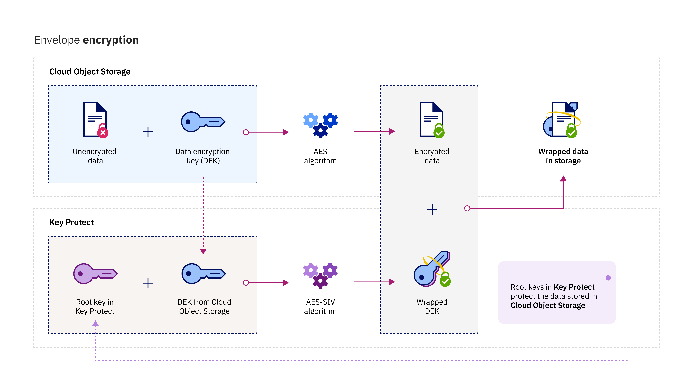

---

copyright:
  years: 2017, 2018
lastupdated: "2018-01-03"

---

{:shortdesc: .shortdesc}
{:codeblock: .codeblock}
{:screen: .screen}
{:new_window: target="_blank"}
{:pre: .pre}
{:tip: .tip}

# Integrations
{: #integrations}

{{site.data.keyword.keymanagementservicefull}} integrates with {{site.data.keyword.cloud_notm}} data and storage solutions to help you manage encryption in the cloud.
{: shortdesc}

You can integrate the {{site.data.keyword.keymanagementserviceshort}} service with storage solutions, such as [{{site.data.keyword.objectstorageshort}} ](/docs/services/ObjectStorage/index.html), to encrypt your data at rest in the cloud. Each document can be protected by a different key, so you have granular control of your data. You can also use {{site.data.keyword.keymanagementserviceshort}} to bring and manage your own encryption to the following services:

- [{{site.data.keyword.cos_full_notm}} ](/docs/services/cloud-object-storage/about-cos.html#about-ibm-cloud-object-storage)

## {{site.data.keyword.keymanagementservicelong_notm}} and {{site.data.keyword.cos_full_notm}}

You can perform envelope encryption on {{site.data.keyword.cos_full_notm}} resources by using the {{site.data.keyword.keymanagementserviceshort}} service.

### About {{site.data.keyword.cos_full_notm}}
{: #cos}

{{site.data.keyword.cos_full_notm}} provides cloud storage for unstructured data. Unstructured data refers to files, audio/visual media, PDFs, compressed data archives, backup images, application artifacts, business documents, or any other binary object.  

To maintain data integrity and availability, {{site.data.keyword.cos_full_notm}} slices, balances, and disperses data to storage nodes across multiple geographic locations. No complete copy of the data resides in any single storage node, and only a subset of nodes needs to be available so you can fully retrieve the data on the network. Provider-side encryption is provided, so your data is secured at rest and in flight. To manage storage, you create buckets and import objects with the {{site.data.keyword.cloud_notm}} console, or programmatically by using the [{{site.data.keyword.cos_full_notm}} REST API](/docs/services/cloud-object-storage/api-reference/about-compatibility-api.html#about-the-cos-api).

For more information, see [Getting Started with COS](/docs/services/cloud-object-storage/getting-started.html#getting-started-cli-).

## How it works
{: #kp_cos_how}

{{site.data.keyword.keymanagementserviceshort}} integrates with {{site.data.keyword.cos_full_notm}} to help you achieve full control of the security of your data.  

As you move data into your instance of {{site.data.keyword.cos_full_notm}}, the service automatically encrypts your objects with data encryption keys (DEKs). Within {{site.data.keyword.cos_full_notm}}, DEKs are stored in the service securely, near the resources that they encrypt. When you need to access a bucket, the service checks your user permissions and decrypts the objects within the bucket for you. This encryption model is called _provider-managed encryption_.

To enable the security benefits of _customer-managed encryption_, you can add envelope encryption to your DEKs in {{site.data.keyword.cos_full_notm}} by integrating with the {{site.data.keyword.keymanagementserviceshort}} service. With {{site.data.keyword.keymanagementserviceshort}}, you provision highly secure root keys, which serve as a master keys that you control in the service. When you create a bucket in {{site.data.keyword.cos_full_notm}}, you can configure envelope encryption for the bucket at its creation. This added protection wraps (or encrypts) the DEKs associated with the bucket by using a root key that you manage in {{site.data.keyword.keymanagementserviceshort}}. The practice, called _key wrapping_, uses multiple AES algorithms to protect the privacy and the integrity of your DEKs, so only you control access to their associated data.

The following figure shows how {{site.data.keyword.keymanagementserviceshort}} integrates with {{site.data.keyword.cos_full_notm}} to further secure your encryption keys.

To learn more about how envelope encryption works in {{site.data.keyword.keymanagementserviceshort}}, see [Envelope encryption](/docs/services/keymgmt/keyprotect_envelope.html).

## Granting access between the services
{: #grant_access}

When you need to grant access between your {{site.data.keyword.cos_full_notm}} and {{site.data.keyword.keymanagementserviceshort}} service instances, you can set authorizations by using the {{site.data.keyword.iamlong}} dashboard. Authorizations enable service to service access policies, so you can associate your storage buckets in COS with root keys provisioned in {{site.data.keyword.keymanagementserviceshort}}.

To create an authorization:

1. From the menu bar, click **Manage** &gt; **Account** &gt; **Identity and Access**, and then select **Authorizations**. 
2. Click **Create authorization**.
3. Select a source and target for the authorization.
 
    a. For **Source service**, select **{{site.data.keyword.cos_full_notm}}**.

    b. For **Target service**, select **{{site.data.keyword.keymanagementservicelong_notm}}**. 
4. To grant read-only access between the services, select the **Reader** check box.

    With _Reader_ permissions, your instance of {{site.data.keyword.cos_full_notm}} can browse the root keys that are provisioned in the specified instance of {{site.data.keyword.keymanagementserviceshort}}. During bucket creation, you can associate your bucket with a {{site.data.keyword.keymanagementserviceshort}} root key that you specify.
5. Click **Authorize**.

To learn more about service authorizations, see the [IAM documentation](/docs/iam/authorizations.html#serviceauth). 

## Adding envelope encryption to your storage buckets
{: #kp_cos_envelope}

[After you designate a root key in {{site.data.keyword.keymanagementserviceshort}}](/docs/services/keymgmt/keyprotect_create_keys.html) and grant access between your services, you can enable envelope encryption for a specified storage bucket by using the {{site.data.keyword.cos_full_notm}} GUI.

**Note:** Envelope encryption is currently available only for buckets provisioned in the US South region. To enable advanced configuration options for your storage bucket, ensure that a service to service policy exists between your COS and {{site.data.keyword.keymanagementserviceshort}} service instances.

To add envelope encryption to your storage bucket:

1. From your {{site.data.keyword.cos_full_notm}} dashboard, click **Create bucket**.
2. Specify the bucket's details.
3. In the **Advanced Configuration** section, select **Add {{site.data.keyword.keymanagementserviceshort}} Keys**.
4. From the list of {{site.data.keyword.keymanagementserviceshort}} service instances, select the instance that contains the root key that you want to use for key wrapping.
5. For **Key Name**, select the alias of the root key.
6. Click **Create** to confirm the bucket creation.

From the {{site.data.keyword.cos_full_notm}} GUI, you can browse the buckets that are protected by a {{site.data.keyword.keymanagementserviceshort}} root key.

## {{site.data.keyword.keymanagementserviceshort}} API methods
{: #api_methods}

Behind the scenes, the {{site.data.keyword.keymanagementserviceshort}} API drives the key wrapping (or envelope encryption) process.  

The following table lists the API methods that add or remove envelope encryption when they are called:

<table>
  <tr>
    <th>Method</th>
    <th>Description</th>
  </tr>
  <tr>
    <td><code>POST /keys/{root_key_ID}?action=wrap</code></td>
    <td><a href="/docs/services/keymgmt/keyprotect_wrap_keys.html">Wrap (encrypt) a data encryption key</a></td>
  </tr>
  <tr>
    <td><code>POST /keys/{root_key_ID}?action=unwrap</code></td>
    <td><a href="/docs/services/keymgmt/keyprotect_unwrap_keys.html">Unwrap (decrypt) a data encryption key</a></td>
  </tr>
  <caption style="caption-side:bottom;">Table 1. Description of {{site.data.keyword.keymanagementserviceshort}} API methods</caption>
</table>

To find out more about programmatically managing your keys in {{site.data.keyword.keymanagementserviceshort}}, check out the [{{site.data.keyword.keymanagementserviceshort}} API reference doc](https://console.ng.bluemix.net/apidocs/639) for code samples.

