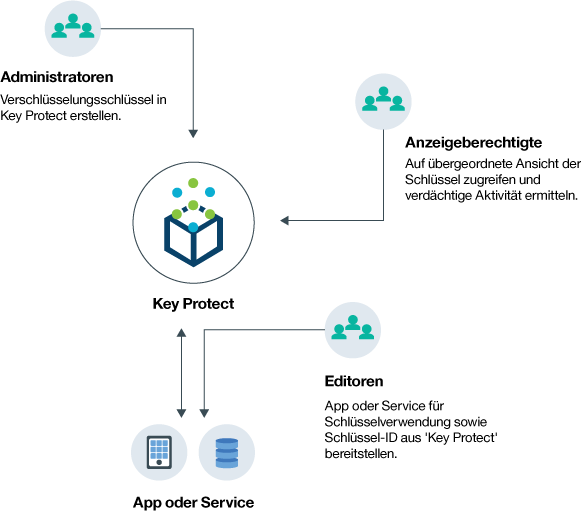
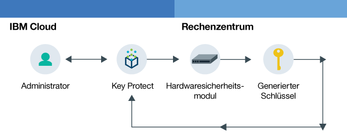

---

copyright:
  years: 2017
lastupdated: "2017-08-03"

---

{:shortdesc: .shortdesc}
{:codeblock: .codeblock}
{:screen: .screen}
{:new_window: target="_blank"}
{:pre: .pre}
{:tip: .tip}

# Informationen zu {{site.data.keyword.keymanagementserviceshort}}

Mit {{site.data.keyword.keymanagementservicelong}} können Sie Schlüssel in unterschiedlichen Szenarios verwalten.
{: shortdesc}

## Gründe für die Verwendung des {{site.data.keyword.keymanagementserviceshort}}-Service
{: #kp_reasons}

Die Verwaltung von Schlüsseln kommt zum Beispiel in den folgenden Szenarios in Betracht:

<table>
  <tr>
    <th>Szenario</th>
    <th>Ursache</th>
  </tr>
  <tr>
    <td>Sie müssen große Mengen an sensiblen Daten, z. B. Krankenakten, nach individueller Ressource verschlüsseln. </td>
    <td>Sie können den {{site.data.keyword.keymanagementserviceshort}}-Service in Speicherlösungen wie z. B. [{{site.data.keyword.objectstorageshort}} ](https://console.bluemix.net/docs/services/ObjectStorage/index.html "Symbol für externen Link") integrieren, um die ruhenden Daten in der Cloud zu verschlüsseln. Jedes Dokument kann durch einen anderen Schlüssel geschützt werden; somit ist eine differenzierte Steuerung Ihrer Daten möglich.</td>
  </tr>
  <tr>
    <td>Als IT-Administrator für ein Großunternehmen müssen Sie Schlüssel für viele unterschiedliche Serviceangebote integrieren, überwachen und turnusmäßig wechseln. </td>
    <td>Die {{site.data.keyword.keymanagementserviceshort}}-Schnittstelle vereinfacht das Management mehrerer Verschlüsselungsservices. Mit dem Service können Sie Schlüssel an einer zentralen Position verwalten und sortieren oder Schlüssel nach Projekt trennen und in verschiedene {{site.data.keyword.Bluemix_short}}-Bereiche aufnehmen.</td>
  </tr>
  <tr>
    <td>Sie sind Sicherheitsadministrator in einem Unternehmensbereich (z. B. Finanzen oder Recht), der die Governance zum Datenschutz einhalten muss. Sie müssen gesteuerten Zugriff von Schlüsseln gewähren, ohne dass die gesicherten Daten beeinträchtigt werden.</td>
    <td>Mit dem Service können Sie den Benutzerzugriff zum Verwalten von Schlüsseln durch das [Zuweisen unterschiedlicher {{site.data.keyword.Bluemix_notm}}-Rollen](managing-keys.html#viewkeyassignments) steuern. Sie können beispielsweise Benutzern Lesezugriff erteilen, die Informationen zur Schlüsselerstellung anzeigen müssen, ohne die Schlüsselinformationen anzuzeigen.</td>
  <tr>
    <td>Als Entwickler können Sie bereits vorhandene Anwendungen, wie zum Beispiel selbstverschlüsselnden Speicher, in {{site.data.keyword.keymanagementserviceshort}} integrieren. Sie können auch Ihre eigenen Apps entwickeln, die mit dem Service integriert werden. </td>
    <td>Apps in oder außerhalb von {{site.data.keyword.Bluemix_notm}} können mit den {{site.data.keyword.keymanagementserviceshort}}-APIs integriert werden. Sie können eigene vorhandene Schlüssel für Ihre Apps verwenden. </td>
  </tr>
  <tr>
    <td>Für Ihr Entwicklungsteam gelten strenge Richtlinien und sie benötigen eine Methode, um alle 14 Tage Schlüssel zu generieren und zu wechseln. </td>
    <td>Mit {{site.data.keyword.Bluemix_notm}} können Sie innerhalb kurzer Zeit Schlüssel über ein Hardwaresicherheitsmodul (HSM) generieren, um die geltenden Sicherheitsvorgaben zeitgerecht zu erfüllen. </td>
  </tr>
</table>

## Funktionsweise von {{site.data.keyword.keymanagementserviceshort}}
{: #kp_how}

{{site.data.keyword.keymanagementservicelong_notm}} unterstützt Sie bei der Verwaltung von Verschlüsselungsschlüsseln in Ihrer Organisation, und zwar durch die Ausrichtung an {{site.data.keyword.Bluemix_notm}}-Rollen.

Ein IT- oder ein Sicherheitsadministrator benötigt erweiterte Berechtigungen, die ein Auditor möglicherweise nicht braucht. Zur Vereinfachung des Zugriffs wird {{site.data.keyword.keymanagementserviceshort}} {{site.data.keyword.Bluemix_notm}}-Rollen zugeordnet, sodass jede Rolle über eine andere Ansicht des Service verfügt. Informationen dazu, welche Ansicht und welche Zugriffsebene für Sie am besten geeignet ist, finden Sie in [Schlüssel und Zugriff prüfen](managing-keys.html#viewkeyassignments).

Das folgende Diagramm zeigt, wie Administratoren, Auditoren und Entwickler mit Schlüsseln interagieren, die im Service verwaltet werden.

<dl>
  <dt>Serviceintegration</dt>
    <dd>Administratoren für Ihren {{site.data.keyword.Bluemix_notm}}-Bereich verwalten die Schlüssel für die Verschlüsselung. </dd>
  <dt>Prüfungen</dt>
    <dd>Auditoren überprüfen die Verwendung von Schlüsseln und ermitteln verdächtige Aktivitäten. </dd>
  <dt>Apps</dt>
    <dd>Entwickler verwalten die Schlüssel für die Verschlüsselung, die Sie in Apps codieren.</dd>
</dl>

## {{site.data.keyword.keymanagementserviceshort}}-Architektur
{: #kp_architecture}

{{site.data.keyword.keymanagementservicelong_notm}} greift auf branchenweit anerkannte Technologie zurück.

<dl>
  <dt>{{site.data.keyword.Bluemix_notm}}-Server</dt>
    <dd>Mit Identitätsdaten, Projekten und ihren Tokens aus dem {{site.data.keyword.Bluemix_notm}}-Server kann der {{site.data.keyword.keymanagementserviceshort}}-Service Ressourcen und Schlüssel einander zuordnen.</dd>
  <dt>API für {{site.data.keyword.keymanagementserviceshort}}</dt>
    <dd>Die {{site.data.keyword.keymanagementserviceshort}}-REST-API ermöglicht das Erstellen und Verwalten von Schlüsseln. Der Service stellt eine Multi-Tenant-Funktionalität bereit. </dd>
  <dt>Benutzerschnittstelle in {{site.data.keyword.Bluemix_notm}}</dt>
    <dd>Über die {{site.data.keyword.keymanagementserviceshort}}-Benutzerschnittstelle (UI) können Sie mit Ihren Schlüsseln sicher arbeiten.</dd>
  <dt>Hardwaresicherheitsmodul (HSM)</dt>
    <dd>{{site.data.keyword.IBM_notm}} Rechenzentren stellen im Hintergrund die Hardware für den Schutz Ihrer Schlüssel bereit.</dd>
  <dt>Datenbankcluster</dt>
    <dd>Sie können sich auf die redundante und sichere Speicherung Ihrer Schlüssel mit einer Clusterdatenbank verlassen.</dd>
</dl>

Die folgenden Diagramme veranschaulichen die Arbeitsweise von {{site.data.keyword.keymanagementserviceshort}} im Verbund mit den Hardwaresicherheitsmodulen beim Generieren von Schlüsseln im Vergleich zu der Schlüsselspeicherung durch den Service.

