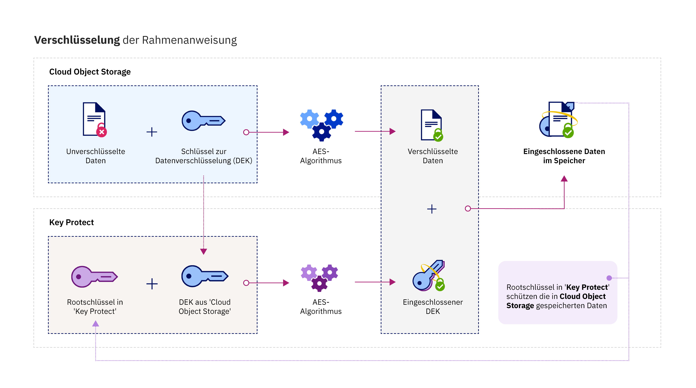

---

copyright:
  years: 2017
lastupdated: "2017-12-15"

---

{:shortdesc: .shortdesc}
{:codeblock: .codeblock}
{:screen: .screen}
{:new_window: target="_blank"}
{:pre: .pre}
{:tip: .tip}

# Integrationen
{: #integrations}

{{site.data.keyword.keymanagementservicefull}} wird in {{site.data.keyword.cloud_notm}}-Daten- und Speicherlösungen integriert, um die Verschlüsselung in der Cloud zu verwalten.
{: shortdesc}

Sie können den {{site.data.keyword.keymanagementserviceshort}}-Service in Speicherlösungen wie z. B. [{{site.data.keyword.objectstorageshort}} ](/docs/services/ObjectStorage/index.html) integrieren, um die ruhenden Daten in der Cloud zu verschlüsseln. Jedes Dokument kann durch einen anderen Schlüssel geschützt werden; somit ist eine differenzierte Steuerung Ihrer Daten möglich. Sie können auch {{site.data.keyword.keymanagementserviceshort}} verwenden, um Ihre eigenen Verschlüsselung in den folgenden Services zu verwalten:

- [{{site.data.keyword.cos_full_notm}} ](/docs/services/cloud-object-storage/about-cos.html#about-ibm-cloud-object-storage)

## {{site.data.keyword.keymanagementservicelong_notm}} und {{site.data.keyword.cos_full_notm}}

Die Envelope-Verschlüsselung kann für {{site.data.keyword.cos_full_notm}}-Ressourcen mithilfe des {{site.data.keyword.keymanagementserviceshort}}-Services durchgeführt werden.

### Informationen zu {{site.data.keyword.cos_full_notm}}
{: #cos}

{{site.data.keyword.cos_full_notm}} stellt Cloudspeicher für unstrukturierte Daten bereit. Unstrukturierte Daten beziehen sich auf Dateien, Audio- und visuelle Medien, PDFs, komprimierte Datenarchive, Backup-Images, Anwendungsartefakte, Geschäftsdokumente oder andere binäre Objekte.  

Damit die Datenintegrität und Verfügbarkeit gewahrt werden kann, zerlegt {{site.data.keyword.cos_full_notm}} Daten, gleicht sie aus und verteilt sie auf Speicherknoten in mehreren geografischen Standorten. In den einzelnen Speicherknoten befinden sich keine vollständigen Datenkopien. Nur eine Teilmenge von Knoten muss verfügbar sein, damit Sie die Daten im Netz komplett abrufen können. Die providerseitige Verschlüsselung wird bereitgestellt, sodass Ihre ruhenden sowie gerade ausgeführten Daten geschützt sind. Um den Speicher zu verwalten, erstellen Sie Buckets und importieren Objekte mithilfe der {{site.data.keyword.cloud_notm}}-Konsole oder verwenden programmgesteuert die [{{site.data.keyword.cos_full_notm}}-REST-API](/docs/services/cloud-object-storage/api-reference/about-compatibility-api.html#about-the-cos-api).

Weitere Informationen finden Sie in [Einführung in COS](/docs/services/cloud-object-storage/getting-started.html#getting-started-cli-).

## Funktionsweise
{: #kp_cos_how}

{{site.data.keyword.keymanagementserviceshort}} wird in {{site.data.keyword.cos_full_notm}} integriert, um einen uneingeschränkten Zugriff auf die Sicherheit Ihrer Daten zu erreichen.  

Wenn Sie Daten in Ihre {{site.data.keyword.cos_full_notm}}-Instanz verschieben, werden Ihre Objekte automatisch mit Datenverschlüsselungsschlüsseln (DEKs) verschlüsselt. DEKs werden in {{site.data.keyword.cos_full_notm}} im Service sicher gespeichert, nahe den Ressourcen, die sie verschlüsseln. Wenn Sie auf ein Bucket zugreifen müssen, prüft der Service Ihre Benutzerberechtigung und entschlüsselt für Sie die Objekte im Bucket. Dieses Verschlüsselungsmodell wird als _providerverwaltete Verschlüsselung_.

Um die Sicherheitsvorteile einer _vom Kunden verwalteten Verschlüsselung_ zu aktivieren, können Sie die Envelope-Verschlüsselung zu Ihren DEKs in {{site.data.keyword.cos_full_notm}} hinzufügen, indem der {{site.data.keyword.keymanagementserviceshort}}-Service integriert wird. Mit {{site.data.keyword.keymanagementserviceshort}} stellen Sie sehr sichere Rootschlüssel bereit, der als Masterschlüssel dient, den Sie im Service steuern können. Wenn Sie in {{site.data.keyword.cos_full_notm}} ein Bucket erstellen, können Sie die Envelope-Verschlüsselung für das Bucket bei seiner Erstellung konfigurieren. Mit diesem hinzugefügten Schutz werden die DEKs, die dem Bucket zugeordnet sind, eingeschlossen (oder verschlüsselt), indem ein in {{site.data.keyword.keymanagementserviceshort}} verwalteter Rootschlüssel verwendet wird. Dieses Verfahren wird _Key-Wrapping_ genannt und nutzt mehrere AES-Algorithmen, um den Datenschutz und die Integrität Ihrer DEKs zu gewährleisten. Daher müssen Sie nur den Zugriff auf die zugeordneten Daten steuern.

In der folgenden Abbildung wird dargestellt, wie {{site.data.keyword.keymanagementserviceshort}} in {{site.data.keyword.cos_full_notm}} integriert wird, um Ihre Verschlüsselungsschlüssel zu sichern.

Weitere Informationen darüber, wie die Envelope-Verschlüsselung in {{site.data.keyword.keymanagementserviceshort}} funktioniert, finden Sie in [Envelope-Verschlüsselung](/docs/services/keymgmt/keyprotect_envelope.html).

## Zugriff zwischen Services gewähren
{: #grant_access}

Wenn Sie Zugriff zwischen {{site.data.keyword.cos_full_notm}} und {{site.data.keyword.keymanagementserviceshort}}-Serviceinstanzen erteilen müssen, können Sie mit dem {{site.data.keyword.iamlong}}-Dashboard Autorisierungen festlegen. Mit diesen Autorisierungen werden Service-zu-Service-Zugriffsrichtlinien aktiviert. Sie können Ihre Speicherbuckets deshalb in COS den Rootschlüsseln zuordnen, die in {{site.data.keyword.keymanagementserviceshort}} bereitgestellt werden.

Gehen Sie wie folgt vor, um eine Autorisierung zu erstellen:

1. Klicken Sie in der Menüleiste auf **Verwalten** &gt; **Konto** &gt; **Identität und Zugriff**. Wählen Sie dann **Autorisierungen** aus. 
2. Klicken Sie auf **Autorisierung erstellen**.
3. Wählen Sie eine Quelle und ein Ziel für die Autorisierung aus.
 
    a. Wählen Sie für **Quellenservice** den Eintrag **{{site.data.keyword.cos_full_notm}}** aus.

    b. Wählen Sie für **Zielservice** den Eintrag **{{site.data.keyword.keymanagementservicelong_notm}}** aus. 
4. Um einen Lesezugriff zwischen den Services zu erteilen, aktivieren Sie das Kontrollkästchen **Leseberechtigter** aus.

    Mit den Berechtigungen als _Leseberechtigter_ kann Ihre {{site.data.keyword.cos_full_notm}}-Instanz die Rootschlüssel durchsuchen, die in der angegebenen Instanz von {{site.data.keyword.keymanagementserviceshort}} bereitgestellt sind. Sie können während der Bucket-Erstellung Ihr Bucket einem von Ihnen angegebenen {{site.data.keyword.keymanagementserviceshort}}-Rootschlüssel zuordnen.
5. Klicken Sie auf **Berechtigen**.

Weitere Informationen zu Serviceautorisierungen finden Sie in den [IAM-Dokumentationen](/docs/iam/authorizations.html#serviceauth). 

## Envelope-Verschlüsselung zu Ihren Speicherbuckets hinzufügen
{: #kp_cos_envelope}

[Nach der Angabe eines Rootschlüssels in {{site.data.keyword.keymanagementserviceshort}}](/docs/services/keymgmt/keyprotect_create_keys.html) und nach der Erteilung des Zugriffs zwischen Ihren Services, können Sie die Envelope-Verschlüsselung für ein bestimmtes Speicherbucket mithilfe der {{site.data.keyword.cos_full_notm}}-GUI aktivieren.

**Hinweis:** Die Envelope-Verschlüsselung ist zurzeit nur für Buckets verfügbar, die in den Vereinigten Staaten (Süden) bereitgestellt werden. Um die erweiterten Konfigurationsoptionen für Ihr Speicherbucket zu aktivieren, stellen Sie sicher, dass ein Service zur Servicerichtlinie zwischen COS und dem {{site.data.keyword.keymanagementserviceshort}}-Serviceinstanzen besteht.

Gehen Sie wie folgt vor, um eine Envelope-Verschlüsselung zur Ihrem Speicherbucket hinzuzufügen:

1. Klicken Sie im {{site.data.keyword.cos_full_notm}}-Dashboard auf **Bucket erstellen**.
2. Geben Sie die Details für das Bucket an.
3. Wählen Sie im Abschnitt **Erweiterte Konfiguration** den Eintrag **{{site.data.keyword.keymanagementserviceshort}}-Schlüssel hinzufügen** aus.
4. Wählen Sie aus der Liste der {{site.data.keyword.keymanagementserviceshort}}-Serviceinstanzen die Instanz aus, die den Rootschlüssel enthält, den Sie für das Key-Wrapping verwenden möchten.
5. Wählen Sie für **Name des Schlüssels** den Alias des Rootschlüssels aus.
6. Klicken Sie auf **Erstellen**, um die Bucket-Erstellung zu bestätigen.

Sie können mit der {{site.data.keyword.cos_full_notm}}-GUI die Buckets durchsuchen, die von einem {{site.data.keyword.keymanagementserviceshort}}-Rootschlüssel geschützt werden.

## {{site.data.keyword.keymanagementserviceshort}}-API-Methoden
{: #api_methods}

Die {{site.data.keyword.keymanagementserviceshort}}-API führt im Hintergrund den Key-Wrapping-Prozess (oder die Envelope-Verschlüsselung) aus.  

In der folgenden Tabelle sind die API-Methoden aufgeführt, mit denen bei einem Aufruf die Envelope-Verschlüsselung hinzugefügt oder entfernt wird:

<table>
  <tr>
    <th>Methode</th>
    <th>Beschreibung</th>
  </tr>
  <tr>
    <td><code>POST /keys/{root_key_ID}?action=wrap</code></td>
    <td><a href="/docs/services/keymgmt/keyprotect_wrap_keys.html">Einschließen (Verschlüsseln) eines Datenverschlüsselungsschlüssels</a></td>
  </tr>
  <tr>
    <td><code>POST /keys/{root_key_ID}?action=unwrap</code></td>
    <td><a href="/docs/services/keymgmt/keyprotect_unwrap_keys.html">Ausschließen (Entschlüsseln) eines Datenverschlüsselungsschlüssels</a></td>
  </tr>
  <caption style="caption-side:bottom;">Tabelle 1. Beschreibung von {{site.data.keyword.keymanagementserviceshort}}-API-Methoden</caption>
</table>

Weitere Informationen zur programmgestützten Verwaltung Ihrer Schlüssel in {{site.data.keyword.keymanagementserviceshort}} finden Sie in den Codebeispielen in der [{{site.data.keyword.keymanagementserviceshort}}API-Referenzdokumentation](https://console.ng.bluemix.net/apidocs/639).

