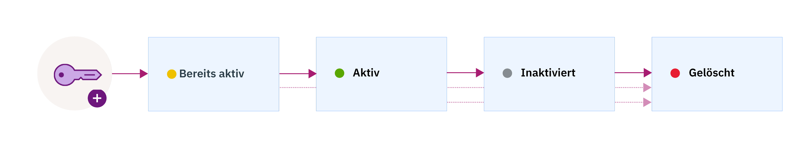

---

copyright:
  years: 2017
lastupdated: "2017-12-15"

---

{:shortdesc: .shortdesc}
{:codeblock: .codeblock}
{:screen: .screen}
{:new_window: target="_blank"}
{:pre: .pre}
{:tip: .tip}

# Schlüsselzustände
{: #key-states}

{{site.data.keyword.keymanagementservicefull}} orientiert sich an den Sicherheitsrichtlinien von [NIST SP 800-57 für die Schlüsselstatus ](http://nvlpubs.nist.gov/nistpubs/SpecialPublications/NIST.SP.800-57pt1r4.pdf){: new_window}.
{: shortdesc}

## Schlüsselzustände und -übergänge
{: #key_transitions}

Ein Schlüssel kann innerhalb seines Lebenszyklus eine Abfolge von vier Statuszuständen durchlaufen.

Im folgenden Diagramm wird dargestellt, wie ein Schlüssel mehrere Zustände zwischen Generierung und Vernichtung durchläuft.

<table>
  <tr>
    <th>Zustand</th>
    <th>Beschreibung</th>
  </tr>
  <tr>
    <td>Bereits aktiviert</td>
    <td>Die Schlüssel werden zu Beginn im Status <i>Pre-activation</i> erstellt. Der bereits aktivierte Schlüssel kann zu anderen Zwecken als zum Nachweis des Besitzes oder zur Schlüsselbestätigung nicht zum verschlüsselten Schutz von Daten verwendet werden.</td>
  </tr>
  <tr>
    <td>Aktiv</td>
    <td>Die Schlüssel werden sofort in den Status <i>Active</i> überführt, wenn das Aktivierungsdatum erreicht wird. Dieser Übergang kennzeichnet den Beginn der Schlüssel-Kryptoperiode. Schlüssel ohne Aktivierungsdatum werden sofort aktiviert und bleiben so lange aktiv, bis sie ablaufen oder gelöscht werden.</td>
  </tr>
  <tr>
    <td>Inaktiviert</td>
    <td>Ein Schlüssel wird in den Zustand <i>Deactivated</i> überführt, wenn ein Ablaufdatum zugewiesen wurde und dieses Ablaufdatum erreicht wird. In diesem Status kann der Schlüssel nicht mehr zum Schutz von Daten durch Verschlüsselung verwendet werden und kann nur noch in den Status <i>Destroyed</i> versetzt werden.</td>
  </tr>
  <tr>
    <td>Gelöscht</td>
    <td>Gelöschte Schlüssel befinden sich im Status <i>Destroyed</i>. Schlüssel, die sich in diesem Status befinden, sind nicht wiederherstellbar. Die zugehörigen Metadaten für den Schlüssel werden in der {{site.data.keyword.keymanagementserviceshort}}-Datenbank aufbewahrt.</td>
  </tr>
  <caption style="caption-side:bottom;">Tabelle 1. Beschreibt die Schlüsselzustände und -übergänge.</caption>
</table>

Nachdem Sie dem Service einen Schlüssel hinzugefügt haben, verwenden Sie das {{site.data.keyword.keymanagementserviceshort}}-Dashboard oder die {{site.data.keyword.keymanagementserviceshort}}-REST-APIs, um den Verlauf und die Konfiguration des Schlüsselzustands anzuzeigen. Sie können zu Prüfzwecken die Aktivitätenprüfliste für einen Schlüssel überwachen, indem Sie {{site.data.keyword.keymanagementserviceshort}} in {{site.data.keyword.cloudaccesstrailfull}} integrieren. Wenn beide Services bereitgestellt sind und ausgeführt werden, werden Aktivitätsereignisse generiert und in einem {{site.data.keyword.cloudaccesstrailshort}}-Protokoll automatisch erfasst, wenn Sie in {{site.data.keyword.keymanagementserviceshort}} Schlüssel erstellen und löschen. 

Weitere Informationen finden Sie in der [Überwachung der {{site.data.keyword.keymanagementserviceshort}}-Aktivität ](https://console.stage1.bluemix.net/docs/services/cloud-activity-tracker/svcs/kp_at.html#kp_at){: new_window}.
