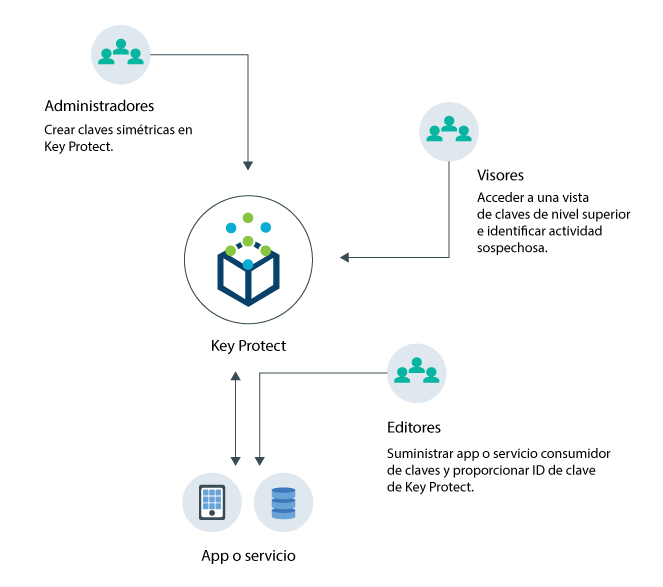
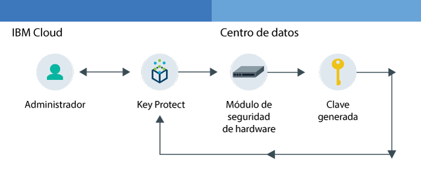
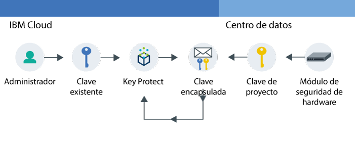

---

copyright:
  years: 2017
lastupdated: "2017-08-03"

---

{:shortdesc: .shortdesc}
{:codeblock: .codeblock}
{:screen: .screen}
{:new_window: target="_blank"}
{:pre: .pre}
{:tip: .tip}

# Acerca de {{site.data.keyword.keymanagementserviceshort}}

Con {{site.data.keyword.keymanagementservicelong}}, puede gestionar claves en varios escenarios.
{: shortdesc}

## Motivos para utilizar {{site.data.keyword.keymanagementserviceshort}}
{: #kp_reasons}

Es posible que desee gestionar claves en los siguientes casos de ejemplo:

<table>
  <tr>
    <th>Caso de ejemplo</th>
    <th>Motivo</th>
  </tr>
  <tr>
    <td>Necesita cifrar altos volúmenes de datos confidenciales, como expedientes médicos, por recurso individual.</td>
    <td>Puede integrar el servicio {{site.data.keyword.keymanagementserviceshort}} con las soluciones de almacenamiento, como [{{site.data.keyword.objectstorageshort}} ](https://console.bluemix.net/docs/services/ObjectStorage/index.html "Icono de enlace externo"), para cifrar sus datos en reposo en la nube. Cada documento puede estar protegido por una clave distinta, por lo que tiene un control granular de los datos.</td>
  </tr>
  <tr>
    <td>Como administrador de TI de una gran empresa, necesita integrar, hacer el seguimiento y rotar miles de claves de muchas ofertas de servicio distintas.</td>
    <td>La interfaz de {{site.data.keyword.keymanagementserviceshort}}
simplifica la gestión de múltiples servicios de cifrado. Con el servicio puede gestionar y ordenar claves en una ubicación centralizada, o puede separar claves por proyectos y alojarlas en distintos espacios de {{site.data.keyword.Bluemix_short}}.</td>
  </tr>
  <tr>
    <td>Como administrador de seguridad de un sector, como finanzas o jurídico, debe ajustarse a las regulaciones sobre cómo se deben proteger datos. Necesita otorgar acceso controlado a las claves sin poner en riesgo los datos que se protegen.</td>
    <td>Gracias al servicio, puede controlar el acceso a los usuarios para gestionar claves
[asignando distintos {{site.data.keyword.Bluemix_notm}} roles](managing-keys.html#viewkeyassignments). Por ejemplo, puede otorgar acceso de solo lectura a los usuarios que requieran ver la información de creación de claves, sin ver el material clave.</td>
  <tr>
    <td>Como desarrollador, puede integrar aplicaciones preexistentes, como por ejemplo el almacenamiento de autocifrado,
en {{site.data.keyword.keymanagementserviceshort}}. También
puede desarrollar sus propias apps que se integran con el servicio.</td>
    <td>Las apps que se encuentran en {{site.data.keyword.Bluemix_notm}} o fuera pueden integrarse con las API de {{site.data.keyword.keymanagementserviceshort}}. Puede utilizar sus propias claves existentes para las apps. </td>
  </tr>
  <tr>
    <td>El equipo de desarrollo tiene políticas estrictas y necesita encontrar una forma de generar y rotar las claves cada 14 días.</td>
    <td>Gracias a {{site.data.keyword.Bluemix_notm}}, puede generar claves rápidamente desde un módulo de seguridad
de hardware (HSM) que satisfagan sus necesidades de seguridad continua.</td>
  </tr>
</table>

## Cómo funciona {{site.data.keyword.keymanagementserviceshort}}
{: #kp_how}

{{site.data.keyword.keymanagementservicelong_notm}} le ayuda a gestionar las claves en toda su organización
alineando los roles de {{site.data.keyword.Bluemix_notm}}.

Un administrador de TI o de seguridad necesita permisos avanzados que un auditor. Para simplificar el acceso, {{site.data.keyword.keymanagementserviceshort}} se correlaciona con los roles de {{site.data.keyword.Bluemix_notm}} de forma que cada rol tiene una vista distinta del servicio. Para obtener información sobre qué vista y nivel de acceso se ajustan mejor a sus necesidades, consulte [Auditoría de claves y acceso](managing-keys.html#viewkeyassignments).

El siguiente diagrama muestra cómo pueden interactuar los administradores, auditores y desarrollados con las claves
gestionadas en el servicio.

<dl>
  <dt>Integración de servicios</dt>
    <dd>Los administradores de su espacio de {{site.data.keyword.Bluemix_notm}} gestionan las claves para la criptografía.</dd>
  <dt>Auditorías</dt>
    <dd>Los auditores inspeccionan el uso de claves e identifican actividades sospechosas.</dd>
  <dt>Apps</dt>
    <dd>Los desarrolladores gestionan las claves para la criptografía que codifican en apps.</dd>
</dl>

## Arquitectura de {{site.data.keyword.keymanagementserviceshort}}
{: #kp_architecture}

{{site.data.keyword.keymanagementservicelong_notm}} está compuesto por
tecnologías aceptadas por el sector.

<dl>
  <dt>Servidor de {{site.data.keyword.Bluemix_notm}}</dt>
    <dd>La identidad, los proyectos y sus señales del servidor de {{site.data.keyword.Bluemix_notm}} permiten al servicio de {{site.data.keyword.keymanagementserviceshort}} correlacionar recursos en
claves.</dd>
  <dt>API para {{site.data.keyword.keymanagementserviceshort}}</dt>
    <dd>Creación y gestión de unidades de {{site.data.keyword.keymanagementserviceshort}} REST API. El servicio proporciona multitenencia cifrada.</dd>
  <dt>Interfaz de usuario en {{site.data.keyword.Bluemix_notm}}</dt>
    <dd>Con la interfaz de usuario (UI) de {{site.data.keyword.keymanagementserviceshort}},
puede trabajar con las claves de forma segura.</dd>
  <dt>Módulo de seguridad de hardware (HSM)</dt>
    <dd>Entre bastidores, los centros de datos de {{site.data.keyword.IBM_notm}} proporcionan hardware para proteger sus claves.</dd>
  <dt>Clúster de base de datos</dt>
    <dd>Puede contar con el almacenamiento redundante y protegido de las claves con una base de datos de clúster.</dd>
</dl>

Los siguientes diagramas muestran cómo funciona {{site.data.keyword.keymanagementserviceshort}} con los módulos de seguridad del
hardware para generar claves comparadas con cómo almacena claves el servicio.

