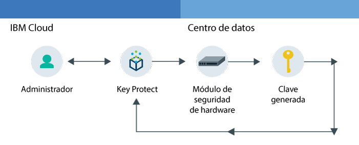
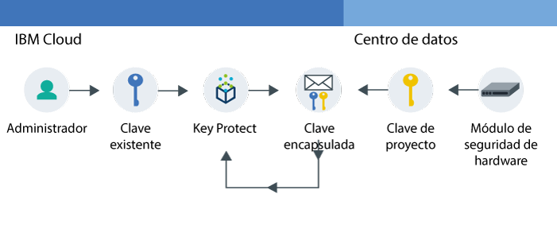

---

copyright:
  years: 2017
lastupdated: "2017-11-08"

---

{:shortdesc: .shortdesc}
{:codeblock: .codeblock}
{:screen: .screen}
{:new_window: target="_blank"}
{:pre: .pre}
{:tip: .tip}

# Acerca de {{site.data.keyword.keymanagementserviceshort}}

{{site.data.keyword.keymanagementservicefull}} le ayuda a suministrar claves cifradas para apps en servicios de {{site.data.keyword.cloud_notm}}. A medida que gestiona el ciclo de vida de sus claves, puede beneficiarse de saber que sus claves están aseguradas por módulos de hardware (HSM) con certificación FIPS 140-2 Nivel 2 basados en la nube que le protegen contra el robo de información.
{: shortdesc}

## Casos de uso de {{site.data.keyword.keymanagementserviceshort}}
{: #kp_reasons}

A continuación se muestran casos prácticos de {{site.data.keyword.keymanagementserviceshort}}:

<table>
  <tr>
    <th>Caso práctico</th>
    <th>Solución</th>
  </tr>
  <tr>
    <td>Necesita cifrar altos volúmenes de datos confidenciales, como expedientes médicos, por recurso individual.</td>
    <td>Puede integrar el servicio {{site.data.keyword.keymanagementserviceshort}} con soluciones de almacenamiento, como [{{site.data.keyword.objectstorageshort}} ](https://console.bluemix.net/docs/services/ObjectStorage/index.html), para cifrar los datos en reposo en la nube. Cada documento puede estar protegido por una clave distinta, por lo que tiene un control granular de los datos.</td>
  </tr>
  <tr>
    <td>Como administrador de TI de una gran empresa, necesita integrar, hacer el seguimiento y rotar las claves de muchas ofertas de servicio distintas.</td>
    <td>La interfaz de {{site.data.keyword.keymanagementserviceshort}} simplifica la gestión de múltiples servicios de cifrado. Con el servicio puede gestionar y ordenar claves en una ubicación centralizada, o puede separar claves por proyectos y alojarlas en distintos espacios de {{site.data.keyword.cloud_notm}}.</td>
  </tr>
  <tr>
    <td>Como administrador de seguridad de un sector, como finanzas o jurídico, debe ajustarse a las regulaciones sobre cómo se deben proteger datos. Necesita otorgar acceso controlado a las claves sin poner en riesgo los datos que se protegen.</td>
    <td>Con el servicio, puede controlar el acceso de usuario para gestionar claves [asignando distintos roles de Identity and Access Management](/docs/services/keyprotect_manage_access.html#roles). Por ejemplo, puede otorgar acceso de solo lectura a los usuarios que requieran ver la información de creación de claves, sin ver el material de la clave.</td>
  <tr>
    <td>Como desarrollador, puede integrar aplicaciones preexistentes, como por ejemplo el almacenamiento de autocifrado, en {{site.data.keyword.keymanagementserviceshort}}. También puede desarrollar sus propias apps que se integran con el servicio.</td>
    <td>Las apps que se encuentran en {{site.data.keyword.cloud_notm}} o fuera pueden integrarse con las API de {{site.data.keyword.keymanagementserviceshort}}. Puede utilizar sus propias claves existentes para las apps. </td>
  </tr>
  <tr>
    <td>El equipo de desarrollo tiene políticas estrictas y necesita encontrar una forma de generar y rotar las claves cada 14 días.</td>
    <td>Gracias a {{site.data.keyword.keymanagementserviceshort}}, puede generar claves rápidamente desde un módulo de seguridad de hardware (HSM) que satisfagan sus necesidades de seguridad continua.</td>
  </tr>
  <caption style="caption-side:bottom;">Tabla 1. Variables necesarias para añadir claves mediante la API de {{site.data.keyword.keymanagementserviceshort}}</caption>
</table>

## Cómo funciona {{site.data.keyword.keymanagementserviceshort}}
{: #kp_how}

{{site.data.keyword.keymanagementservicelong_notm}} le ayuda a gestionar las claves en toda su organización alineando los roles de {{site.data.keyword.iamshort}}.

Un administrador de TI o de seguridad necesita permisos avanzados que un auditor. Para simplificar el acceso, {{site.data.keyword.keymanagementserviceshort}} se correlaciona con los roles de {{site.data.keyword.iamshort}} de forma que cada rol tiene una vista distinta del servicio. Para ayudarle a saber qué vista y nivel de acceso se ajustan mejor a sus necesidades, consulte [Gestión de accesos y usuarios](/docs/services/keymgmt/keyprotect_manage_access.html#roles).

El siguiente diagrama muestra cómo los administradores, visores, y editores pueden interactuar con las claves gestionadas en el servicio.

<dl>
  <dt>Integración de servicios</dt>
    <dd>Los administradores de su espacio de {{site.data.keyword.cloud_notm}} gestionan las claves para la criptografía.</dd>
  <dt>Vista</dt>
    <dd>Los visores acceden a una vista de alto nivel de claves e identifican actividades sospechosas.</dd>
  <dt>Apps</dt>
    <dd>Los editores gestionan las claves para la criptografía que codifican en apps.</dd>
</dl>

## Arquitectura de {{site.data.keyword.keymanagementserviceshort}}
{: #kp_architecture}

{{site.data.keyword.keymanagementservicelong_notm}} está compuesto por tecnologías aceptadas por el sector.

<dl>
  <dt>Servidor de {{site.data.keyword.cloud_notm}}</dt>
    <dd>La identidad, los proyectos y sus señales del servidor {{site.data.keyword.cloud_notm}} dejan el servicio {{site.data.keyword.keymanagementserviceshort}} para correlacionar recursos a claves.</dd>
  <dt>API para {{site.data.keyword.keymanagementserviceshort}}</dt>
    <dd>Creación y gestión de unidades de {{site.data.keyword.keymanagementserviceshort}} REST API. El servicio proporciona multitenencia cifrada.</dd>
  <dt>Interfaz de usuario en {{site.data.keyword.cloud_notm}}</dt>
    <dd>Con la interfaz de usuario (UI) {{site.data.keyword.keymanagementserviceshort}}, puede trabajar de forma segura con sus claves.</dd>
  <dt>Módulo de seguridad de hardware (HSM)</dt>
    <dd>Entre bastidores, los centros de datos de {{site.data.keyword.cloud_notm}} proporcionan hardware para proteger sus claves.</dd>
  <dt>Clúster de base de datos</dt>
    <dd>Puede contar con el almacenamiento redundante y protegido de las claves con una base de datos de clúster.</dd>
</dl>

Los siguientes diagramas muestran cómo funciona {{site.data.keyword.keymanagementserviceshort}} con los módulos de seguridad del hardware para generar claves comparadas con cómo almacena claves el servicio.

