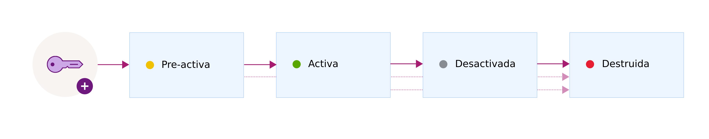

---

copyright:
  years: 2017
lastupdated: "2017-12-15"

---

{:shortdesc: .shortdesc}
{:codeblock: .codeblock}
{:screen: .screen}
{:new_window: target="_blank"}
{:pre: .pre}
{:tip: .tip}

# Estados de clave
{: #key-states}

{{site.data.keyword.keymanagementservicefull}} sigue las directrices de seguridad de [NIST SP 800-57 para estados clave ](http://nvlpubs.nist.gov/nistpubs/SpecialPublications/NIST.SP.800-57pt1r4.pdf){: new_window}.
{: shortdesc}

## Estados y transiciones de clave
{: #key_transitions}

Una clave puede pasar por una serie de cuatro estados en su ciclo de vida.

En el siguiente diagrama se muestra cómo una clave pasa por los distintos estados desde que se crea hasta que se destruye. 

<table>
  <tr>
    <th>Estado</th>
    <th>Descripción</th>
  </tr>
  <tr>
    <td>Pre-activación</td>
    <td>Las claves se crean inicialmente en el estado de <i>pre-activación</i>. Un clave pre-activada se puede utilizar a efectos de prueba de su posesión o de confirmación de la clave, pero no se puede utilizar para proteger datos de forma criptográfica. </td>
  </tr>
  <tr>
    <td>Activa</td>
    <td>Las claves pasan inmediatamente al estado <i>activo</i> en la fecha de activación. Esta transición marca el inicio del periodo criptográfico propiamente dicho de una clave. Las claves sin fecha de activación se activan inmediatamente y permanecen activas hasta que caducan o se destruyen.</td>
  </tr>
  <tr>
    <td>Desactivada</td>
    <td>Una clave pasa al estado de <i>desactivado</i> el día de su fecha de caducidad, si una está asignada. En este estado, la clave no puede proteger criptográficamente los datos y sólo pueden moverse al estado <i>destruido</i>.</td>
  </tr>
  <tr>
    <td>Destruida</td>
    <td>Las claves suprimidas están en estado <i>destruido</i>. Las claves con este estado no son recuperables. Los metadatos asociados con la clave como, por ejemplo, el nombre y el historial de transiciones de la clave, se mantienen en la base de datos de {{site.data.keyword.keymanagementserviceshort}}. </td>
  </tr>
  <caption style="caption-side:bottom;">Tabla 1. Describe los estados y las transiciones de las claves. </caption>
</table>

Después de añadir una clave para el servicio, utilice el panel de control de {{site.data.keyword.keymanagementserviceshort}} o la API REST de {{site.data.keyword.keymanagementserviceshort}} para ver la configuración y el historial de transiciones de las claves. A efectos de auditoría, también puede supervisar la actividad para una clave integrando {{site.data.keyword.keymanagementserviceshort}} con {{site.data.keyword.cloudaccesstrailfull}}. Después de que se hayan suministrado ambos servicios y de que estén en ejecución, los sucesos de actividad se generan de forma automática y se recopilan en un registro de {{site.data.keyword.cloudaccesstrailshort}} cuando crea y suprime claves en {{site.data.keyword.keymanagementserviceshort}}.  

Para obtener más información, consulte [Supervisión de actividad de {{site.data.keyword.keymanagementserviceshort}} ](https://console.stage1.bluemix.net/docs/services/cloud-activity-tracker/svcs/kp_at.html#kp_at){: new_window}.
