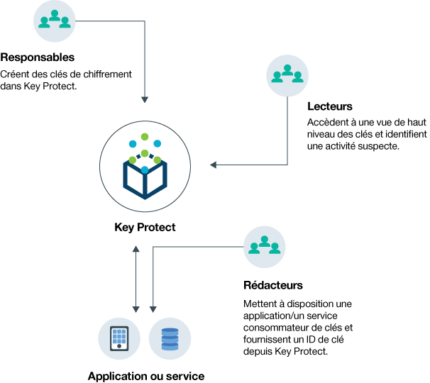
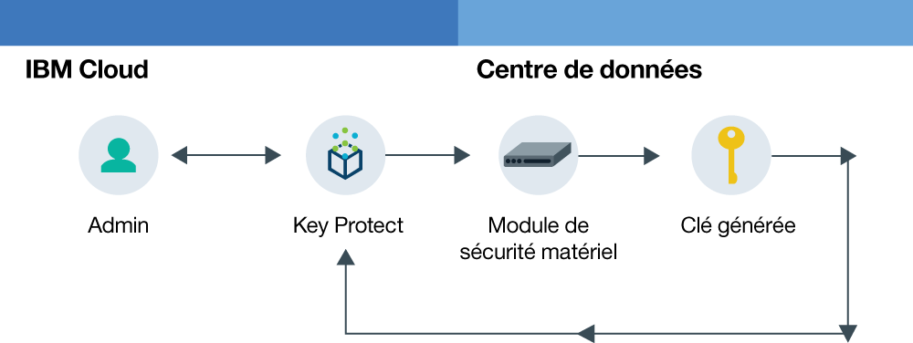
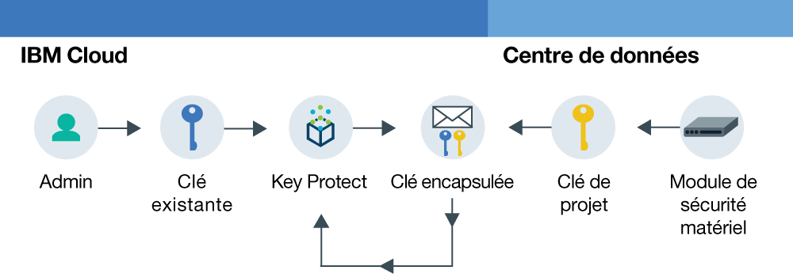

---

copyright:
  years: 2017
lastupdated: "2017-11-08"

---

{:shortdesc: .shortdesc}
{:codeblock: .codeblock}
{:screen: .screen}
{:new_window: target="_blank"}
{:pre: .pre}
{:tip: .tip}

# A propos de {{site.data.keyword.keymanagementserviceshort}}

{{site.data.keyword.keymanagementservicefull}} vous permet de mettre à disposition des clés chiffrées pour les applications dans les services {{site.data.keyword.cloud_notm}}. Dans le cadre de la gestion du cycle de vie de vos clés, sachez que vos clés sont sécurisées par des modules matériels HSM basés sur le cloud certifiés FIPS 140-2 niveau 2 qui vous protègent contre le vol d'informations.
{: shortdesc}

## Cas d'utilisation {{site.data.keyword.keymanagementserviceshort}}
{: #kp_reasons}

Vous trouverez ci-dessous les cas d'utilisation pour {{site.data.keyword.keymanagementserviceshort}} :

<table>
  <tr>
    <th>Cas d'utilisation</th>
    <th>Solution</th>
  </tr>
  <tr>
    <td>Vous avez besoin de chiffrer de gros volumes de données sensibles (dossiers médicaux, par exemple), par ressource individuelle.</td>
    <td>Vous pouvez intégrer le service {{site.data.keyword.keymanagementserviceshort}} à des solutions de stockage, telles qu'[{{site.data.keyword.objectstorageshort}} ](https://console.bluemix.net/docs/services/ObjectStorage/index.html), pour chiffrer vos données inactives dans le cloud. Chaque document peut être protégé par une clé différente, ce qui vous permet d'avoir un contrôle précis sur vos données.</td>
  </tr>
  <tr>
    <td>En tant que responsable informatique d'une grande entreprise, vous êtes chargé du traitement (intégration, suivi et renouvellement) des clés pour de nombreuses offres de service différentes.</td>
    <td>L'interface {{site.data.keyword.keymanagementserviceshort}} simplifie la gestion des services de chiffrement multiples. Avec ce service, vous pouvez gérer et trier des clés dans un emplacement centralisé unique, ou séparer les clés par projet et les héberger dans des espaces {{site.data.keyword.cloud_notm}} différents.</td>
  </tr>
  <tr>
    <td>Vous administrez la sécurité dans le service financier ou juridique d'une entreprise qui est tenue de respecter des règles strictes au niveau de la protection des données. Vous devez accorder des contrôles d'accès aux différentes clés sans pour autant compromettre les données qu'elles sécurisent.</td>
    <td>Avec ce service, vous pouvez contrôler l'accès utilisateur pour la gestion de clés en [affectant des rôles Identity and Access Management différents](/docs/services/keyprotect_manage_access.html#roles). Il vous est ainsi possible d'accorder un accès en lecture seule aux utilisateurs qui ont besoin de voir les informations de création de clé sans afficher le matériel relatif à la clé.</td>
  <tr>
    <td>En tant que développeur, vous pouvez intégrer des applications pré-existantes, telles que le stockage avec auto-chiffrement, au service {{site.data.keyword.keymanagementserviceshort}}. Il vous est aussi possible de développer vos propres applications qui s'intègrent au service.</td>
    <td>Les applications installées sur ou en dehors de {{site.data.keyword.cloud_notm}} peuvent s'intégrer aux API {{site.data.keyword.keymanagementserviceshort}}. Vous pouvez utiliser vos clés existantes pour vos applis. </td>
  </tr>
  <tr>
    <td>Votre équipe de développent applique des règles strictes et vous devez disposer d'un moyen pour générer et renouveler les clés tous les 14 jours.</td>
    <td>Avec {{site.data.keyword.keymanagementserviceshort}}, vous pouvez générer rapidement des clés depuis un module HSM (Hardware Security Module) pour répondre à vos besoins de sécurité actuels.</td>
  </tr>
  <caption style="caption-side:bottom;">Tableau 1. Variables requises pour ajouter des clés via l'API {{site.data.keyword.keymanagementserviceshort}}</caption>
</table>

## Fonctionnement de {{site.data.keyword.keymanagementserviceshort}}
{: #kp_how}

{{site.data.keyword.keymanagementservicelong_notm}} vous aide à gérer les clés de chiffrement dans toute votre organisation en procédant à un alignement avec les rôles {{site.data.keyword.iamshort}}.

Un administrateur de sécurité ou informatique a besoin de droits d'accès avancés qui ne sont pas nécessaires à un auditeur. Pour simplifier l'accès, {{site.data.keyword.keymanagementserviceshort}} effectue un mappage sur les rôles {{site.data.keyword.iamshort}} de façon à ce que chaque rôle dispose d'une vue différente du service. Pour vous aider à déterminer la vue ou le niveau d'accès les mieux adaptés à vos besoins, voir [Gestion des utilisateurs et des accès](/docs/services/keymgmt/keyprotect_manage_access.html#roles).

Le diagramme suivant illustre comment les administrateurs, les afficheurs et les éditeurs peuvent interagir avec les clés qui sont gérées dans le service.

<dl>
  <dt>Intégration de services</dt>
    <dd>Les administrateurs de votre espace {{site.data.keyword.cloud_notm}} gèrent les clés pour le chiffrement.</dd>
  <dt>Vue</dt>
    <dd>Les afficheurs accèdent à une vue de haut niveau des clés et identifient les activités suspectes.</dd>
  <dt>Applis</dt>
    <dd>Les éditeurs gèrent les clés pour le chiffrement qu'ils codent dans les applications.</dd>
</dl>

## Architecture {{site.data.keyword.keymanagementserviceshort}}
{: #kp_architecture}

{{site.data.keyword.keymanagementservicelong_notm}} se compose de technologies acceptées par l'industrie.

<dl>
  <dt>Serveur {{site.data.keyword.cloud_notm}}</dt>
    <dd>L'identité, les projets et les jetons en provenance du serveur {{site.data.keyword.cloud_notm}} permettent au service {{site.data.keyword.keymanagementserviceshort}} de mapper les ressources aux clés.</dd>
  <dt>API pour {{site.data.keyword.keymanagementserviceshort}}</dt>
    <dd>L'API REST {{site.data.keyword.keymanagementserviceshort}} actionne la création et la gestion des clés. Le système fournit un partage de services chiffrés.</dd>
  <dt>Interface utilisateur dans {{site.data.keyword.cloud_notm}}</dt>
    <dd>Du fait de l'interface utilisateur {{site.data.keyword.keymanagementserviceshort}}, vous pouvez utiliser vos clés de façon sécurisée.</dd>
  <dt>Module de sécurité matériel (HSM)</dt>
    <dd>En coulisse, les centres de données {{site.data.keyword.cloud_notm}} fournissent le matériel protégeant vos clés.</dd>
  <dt>Cluster de base de données</dt>
    <dd>Un cluster de base de données garantit un stockage redondant et sécurisé de vos clés.</dd>
</dl>

Le diagramme suivant montre comment {{site.data.keyword.keymanagementserviceshort}} fonctionne avec les modules de sécurité matériel pour générer des clés par rapport à la façon dont le service stocke les clés.

