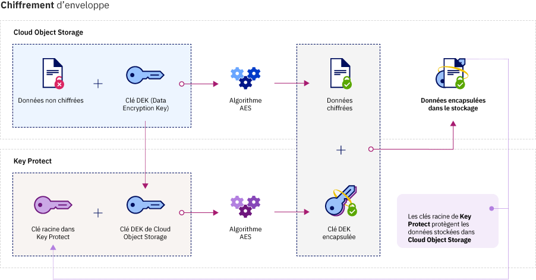

---

copyright:
  years: 2017
lastupdated: "2017-12-15"

---

{:shortdesc: .shortdesc}
{:codeblock: .codeblock}
{:screen: .screen}
{:new_window: target="_blank"}
{:pre: .pre}
{:tip: .tip}

# Intégrations
{: #integrations}

{{site.data.keyword.keymanagementservicefull}} s'intègre aux solutions de données et de stockage {{site.data.keyword.cloud_notm}} pour vous aider à gérer le chiffrement dans le cloud.
{: shortdesc}

Vous pouvez intégrer le service {{site.data.keyword.keymanagementserviceshort}} à des solutions de stockage, telles qu'[{{site.data.keyword.objectstorageshort}} ](/docs/services/ObjectStorage/index.html), pour chiffrer vos données inactives dans le cloud. Chaque document peut être protégé par une clé différente, ce qui vous permet d'avoir un contrôle précis sur vos données. Vous pouvez également utiliser {{site.data.keyword.keymanagementserviceshort}} pour mettre en oeuvre et gérer votre propre chiffrement dans les services suivants :

- [{{site.data.keyword.cos_full_notm}} ](/docs/services/cloud-object-storage/about-cos.html#about-ibm-cloud-object-storage)

## {{site.data.keyword.keymanagementservicelong_notm}} et {{site.data.keyword.cos_full_notm}}

Vous pouvez effectuer le chiffrement d'enveloppe sur des ressources {{site.data.keyword.cos_full_notm}} via le service {{site.data.keyword.keymanagementserviceshort}}.

### A propos d'{{site.data.keyword.cos_full_notm}}
{: #cos}

{{site.data.keyword.cos_full_notm}} permet le stockage de données non structurées dans le cloud. Les données non structurées représentent des fichiers, des supports audiovisuels, des fichiers PDF, des archives de données compressées, des images de sauvegarde, des artefacts d'application, des documents professionnels et tout autre objet binaire.  

Pour assurer l'intégrité et la disponibilité des données, {{site.data.keyword.cos_full_notm}} fractionne, répartit et transmet les données à des noeuds de stockage situés dans différentes zones géographiques. Aucune copie complète des données ne se trouve sur un noeud de stockage unique et un seul sous-ensemble de noeuds  disponible suffit pour vous permettre d'extraire les données sur le réseau. Un chiffrement côté fournisseur est mis en oeuvre pour sécuriser les données au repos et en cours de traitement. Pour gérer le stockage, vous pouvez créer des compartiments et importer des objets à l'aide de la console {{site.data.keyword.cloud_notm}} ou à l'aide d'un programme via l'[API REST {{site.data.keyword.cos_full_notm}}](/docs/services/cloud-object-storage/api-reference/about-compatibility-api.html#about-the-cos-api).

Pour plus d'informations, voir la rubrique décrivant l'[initiation à COS](/docs/services/cloud-object-storage/getting-started.html#getting-started-cli-).

## Fonctionnement
{: #kp_cos_how}

{{site.data.keyword.keymanagementserviceshort}} s'intègre à {{site.data.keyword.cos_full_notm}} pour vous permettre de contrôler intégralement la sécurité de vos données.  

Lorsque vous transférez des données vers l'instance {{site.data.keyword.cos_full_notm}}, le service chiffre automatiquement vos objets avec des clés DEK (Data Encryption Key). Dans {{site.data.keyword.cos_full_notm}}, les clés DEK sont stockées en toute sécurité dans le service, à proximité des ressources qu'elles chiffrent. Si vous devez accéder à un compartiment, le service vérifie vos droits utilisateur et déchiffre pour vous les objets stockés dans le compartiment. Ce modèle de chiffrement est appelé _chiffrement géré par le fournisseur_.

Pour bénéficier des avantages présentés par le _chiffrement géré par le client_ en matière de sécurité, vous pouvez ajouter un mécanisme de chiffrement d'enveloppe à vos clés DEK dans {{site.data.keyword.cos_full_notm}} en l'intégrant au service {{site.data.keyword.keymanagementserviceshort}}. Avec {{site.data.keyword.keymanagementserviceshort}}, vous mettez à disposition des clés racine hautement sécurisées que vous utilisez en tant que clés principales et que vous contrôlez dans le service. Lorsque vous créez un compartiment dans {{site.data.keyword.cos_full_notm}}, vous pouvez configurer le chiffrement d'enveloppe du compartiment au moment de sa création. Cette protection supplémentaire encapsule (ou chiffre) les clés DEK associées au compartiment via une clé racine gérée dans {{site.data.keyword.keymanagementserviceshort}}. Cette pratique, appelée _encapsulage de clés_, utilise plusieurs algorithmes AES pour protéger la confidentialité et l'intégrité de vos clés DEK et vous permettre de contrôler l'accès aux données associées. 

La figure ci-dessous explique comment {{site.data.keyword.keymanagementserviceshort}} s'intègre à {{site.data.keyword.cos_full_notm}} pour renforcer la sécurité de vos clés de chiffrement.

Pour connaître le fonctionnement du chiffrement d'enveloppe dans {{site.data.keyword.keymanagementserviceshort}}, voir [Chiffrement d'enveloppe](/docs/services/keymgmt/keyprotect_envelope.html).

## Octroi d'un accès entre les services
{: #grant_access}

Lorsque vous devez accorder un accès entre vos instances de service {{site.data.keyword.cos_full_notm}} et {{site.data.keyword.keymanagementserviceshort}}, vous pouvez définir des autorisations à l'aide du tableau de bord {{site.data.keyword.iamlong}}. Les autorisations activent des règles d'accès de service à service pour vous permettre d'associer des compartiments de stockage de COS aux clés racine mises à disposition dans {{site.data.keyword.keymanagementserviceshort}}.

Pour créer une autorisation, procédez comme suit :

1. Dans la barre de menus, cliquez sur **Gérer** &gt; **Compte** &gt; **Identity and Access**, puis sélectionnez **Autorisations**. 
2. Cliquez sur **Créer une autorisation**.
3. Sélectionnez une source et une cible pour l'autorisation.
 
    a. Pour le **Service source**, sélectionnez **{{site.data.keyword.cos_full_notm}}**.

    b. Pour le **Service cible**, sélectionnez **{{site.data.keyword.keymanagementservicelong_notm}}**. 
4. Pour accorder un accès en lecture seule entre les services, cochez la case **Lecteur**.

Avec les droits _Lecteur_, votre instance {{site.data.keyword.cos_full_notm}} peut parcourir les clés racine mises à disposition dans l'instance {{site.data.keyword.keymanagementserviceshort}} indiquée. Lors de la création d'un compartiment, vous pouvez associer le compartiment à une clé racine {{site.data.keyword.keymanagementserviceshort}} que vous indiquez.
5. Cliquez sur **Autoriser**.

Pour en savoir plus sur les autorisations de service, voir la [documentation IAM](/docs/iam/authorizations.html#serviceauth). 

## Ajout du chiffrement d'enveloppe à des compartiments de stockage
{: #kp_cos_envelope}

[Après avoir désigné une clé racine dans {{site.data.keyword.keymanagementserviceshort}}](/docs/services/keymgmt/keyprotect_create_keys.html) et accordé un accès entre vos services, vous pouvez activer le chiffrement d'enveloppe pour un compartiment de stockage spécifique à l'aide de l'interface graphique {{site.data.keyword.cos_full_notm}}.

**Remarque :** A l'heure actuelle, le chiffrement d'enveloppe est disponible uniquement pour les compartiments mis à disposition dans la région Sud des Etats-Unis. Pour activer des options de configuration avancées du compartiment de stockage, vérifiez qu'une règle de service à service existe entre les instances de service {{site.data.keyword.keymanagementserviceshort}} et COS.

Pour ajouter le chiffrement d'enveloppe à votre compartiment de stockage, procédez comme suit :

1. Dans le tableau de bord {{site.data.keyword.cos_full_notm}}, cliquez sur **Create bucket**.
2. Indiquez les détails du compartiment.
3. Dans la section **Advanced Configuration**, sélectionnez **Add {{site.data.keyword.keymanagementserviceshort}} Keys**.
4. Dans la liste d'instances de service {{site.data.keyword.keymanagementserviceshort}}, sélectionnez l'instance qui contient la clé racine à utiliser pour l'encapsulage de clés.
5. Pour le **nom de la clé**, sélectionnez l'alias de la clé racine.
6. Cliquez sur **Create** pour confirmer la création de compartiments.

Dans l'interface graphique {{site.data.keyword.cos_full_notm}}, vous pouvez parcourir les compartiments protégés par une clé racine {{site.data.keyword.keymanagementserviceshort}}.

## Méthodes d'API {{site.data.keyword.keymanagementserviceshort}}
{: #api_methods}

L'API {{site.data.keyword.keymanagementserviceshort}} exécute la procédure d'encapsulage de clés (ou de chiffrement d'enveloppe).  

Le tableau ci-dessous répertorie les méthodes d'API qui ajoutent ou suppriment le chiffrement d'enveloppe lorsqu'elles sont appelées :

<table>
  <tr>
    <th>Méthode</th>
    <th>Description</th>
  </tr>
  <tr>
    <td><code>POST /keys/{root_key_ID}?action=wrap</code></td>
    <td><a href="/docs/services/keymgmt/keyprotect_wrap_keys.html">Encapsule (chiffre) une clé de chiffrement de données</a></td>
  </tr>
  <tr>
    <td><code>POST /keys/{root_key_ID}?action=unwrap</code></td>
    <td><a href="/docs/services/keymgmt/keyprotect_unwrap_keys.html">Désencapsule (déchiffre) une clé de chiffrement de données</a></td>
  </tr>
  <caption style="caption-side:bottom;">Tableau 1. Description des méthodes d'API {{site.data.keyword.keymanagementserviceshort}}</caption>
</table>

Pour en savoir plus sur la gestion des clés à l'aide d'un programme dans {{site.data.keyword.keymanagementserviceshort}}, reportez-vous aux exemples de code dans la [ documentation de référence de l'API {{site.data.keyword.keymanagementserviceshort}}](https://console.ng.bluemix.net/apidocs/639).

