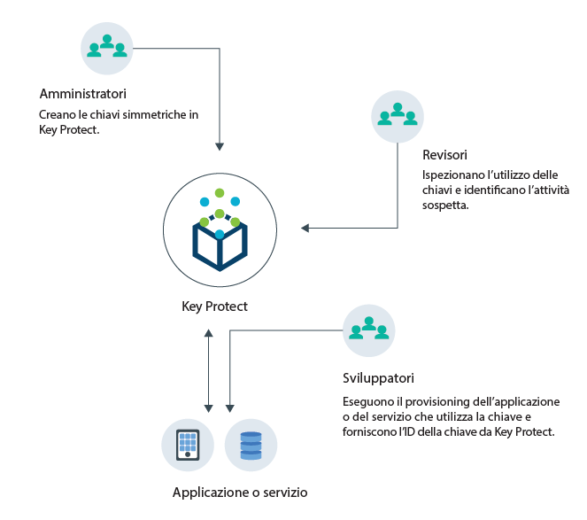
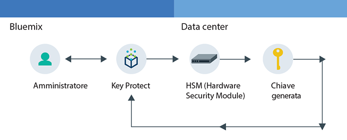
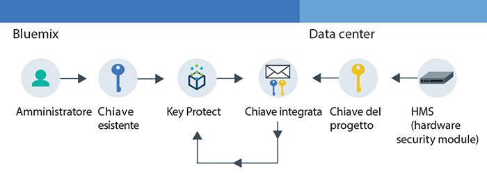

---

copyright:
  years: 2017
lastupdated: "2017-09-21"

---

{:shortdesc: .shortdesc}
{:codeblock: .codeblock}
{:screen: .screen}
{:new_window: target="_blank"}
{:pre: .pre}
{:tip: .tip}

# Informazioni su {{site.data.keyword.keymanagementserviceshort}}

{{site.data.keyword.keymanagementservicefull}} ti aiuta ad eseguire il provisioning di chiavi crittografate per le applicazioni nei servizi {{site.data.keyword.Bluemix_notm}}. Mentre gestisci il ciclo di vita delle tue chiavi,
puoi ottenere dei benefici sapendo che le tue chiavi sono protette
dagli HSM (hardware module) basati sul cloud certificati FIPS-140 che proteggono dal furto di informazioni.
{: shortdesc}

## Casi di utilizzo di {{site.data.keyword.keymanagementserviceshort}}
{: #kp_reasons}

I seguenti sono i casi di utilizzo per {{site.data.keyword.keymanagementserviceshort}}:

<table>
  <tr>
    <th>Caso di utilizzo</th>
    <th>Soluzione</th>
  </tr>
  <tr>
    <td>Hai bisogno di codificare elevati volumi di dati sensibili, come le registrazioni mediche, per risorsa individuale.</td>
    <td>Puoi integrare il servizio {{site.data.keyword.keymanagementserviceshort}} con soluzioni di archiviazione,
come [{{site.data.keyword.objectstorageshort}} ](https://console.bluemix.net/docs/services/ObjectStorage/index.html), per codificare i tuoi data-at-rest nel cloud. Ogni documento può essere protetto da una chiave differente, in questo modo disponi del controllo
granulare ai tuoi dati.</td>
  </tr>
  <tr>
    <td>Come amministratore IT per una grande azienda, hai bisogno di integrare, tracciare e ruotare
le chiavi per molte offerte di servizio differenti. </td>
    <td>L'interfaccia {{site.data.keyword.keymanagementserviceshort}}
semplifica la gestione di più servizi di codifica. Con il servizio, puoi gestire
e ordinare le chiavi in un'ubicazione centralizzata o puoi separarle per progetto e posizionarle
in spazi {{site.data.keyword.Bluemix_short}} differenti.</td>
  </tr>
  <tr>
    <td>Sei un amministratore della sicurezza di una azienda, come un leader finanziario o un avvocato, che deve
rispettare la governance su come vengono protetti i dati. Devi concedere l'accesso controllato alle chiavi
senza compromettere la sicurezza dei dati.</td>
    <td>Con il servizio, puoi controllare l'accesso utente per gestire le chiavi
[assegnando ruoli di gestione dell'accesso e dell'identità differenti](/docs/services/keyprotect_manage_access.html#roles). Ad esempio,
puoi concedere l'accesso in sola lettura agli utenti che necessitano di visualizzare le informazioni sulla creazione delle chiavi senza
visualizzare il materiale della chiave.</td>
  <tr>
    <td>Come sviluppatore, puoi integrare le applicazioni pre-esistenti, come l'archiviazione
con crittografia automatica, in {{site.data.keyword.keymanagementserviceshort}}. Puoi anche
sviluppare le tue proprie applicazioni da integrare con il servizio.</td>
    <td>La applicazioni in o al di fuori di {{site.data.keyword.Bluemix_notm}} possono
essere integrate con le API {{site.data.keyword.keymanagementserviceshort}}. Puoi utilizzare le tue chiavi esistenti per le tue applicazioni. </td>
  </tr>
  <tr>
    <td>Il tuo team di sviluppo ha politiche rigorose e hai bisogno di un modo per generare e ruotare
le chiavi ogni 14 giorni.</td>
    <td>Con {{site.data.keyword.Bluemix_notm}},
puoi generare le chiavi rapidamente da un HSM (hardware security module) per soddisfare i tuoi bisogni di sicurezza
continuativa.</td>
  </tr>
  <caption style="caption-side:bottom;">Tabella 1. Variabili necessarie per aggiungere le chiavi tramite l'API {{site.data.keyword.keymanagementserviceshort}}</caption>
</table>

## Come funziona {{site.data.keyword.keymanagementserviceshort}}
{: #kp_how}

{{site.data.keyword.keymanagementservicelong_notm}} ti aiuta nella gestione delle chiavi di crittografia nella tua organizzazione eseguendo l'allineamento con i ruoli di gestione dell'accesso e dell'identità
{{site.data.keyword.Bluemix_notm}}.

Un amministratore della sicurezza o IT
necessita di autorizzazioni avanzate rispetto a un revisore. Per semplificare l'accesso, {{site.data.keyword.keymanagementserviceshort}}
mappa i ruoli di gestione dell'accesso e dell'identità {{site.data.keyword.Bluemix_notm}} in modo che ogni ruolo abbia una visualizzazione diversa
del servizio. Per agevolare l'orientamento alla visualizzazione e al livello di accesso che meglio rispondono alle tue esigenze, vedi [Gestione di utenti e accesso](/docs/services/keymgmt/keyprotect_manage_access.html#roles).

Il seguente diagramma mostra come gli amministratori, i visualizzatori e gli editor possono
interagire con le chiavi gestite nel servizio.

<dl>
  <dt>Integrazione dei servizi</dt>
    <dd>Gli amministratori per il tuo spazio {{site.data.keyword.Bluemix_notm}}
gestiscono le chiavi per la crittografia.</dd>
  <dt>Vista</dt>
    <dd>I visualizzatori accedono a una vista di alto livello delle chiavi e identificano le attività sospette. </dd>
  <dt>Applicazioni</dt>
    <dd>Gli editor gestiscono le chiavi per la crittografia che codificano nelle applicazioni.</dd>
</dl>

## Architettura {{site.data.keyword.keymanagementserviceshort}}
{: #kp_architecture}

{{site.data.keyword.keymanagementservicelong_notm}} si articola
in tecnologie accettate dal settore.

<dl>
  <dt>Server {{site.data.keyword.Bluemix_notm}}</dt>
    <dd>Identità, progetti e i loro token dal server {{site.data.keyword.Bluemix_notm}} che abilitano il servizio
{{site.data.keyword.keymanagementserviceshort}} ad associare le risorse alle chiavi. </dd>
  <dt>API per {{site.data.keyword.keymanagementserviceshort}}</dt>
    <dd>L'API REST {{site.data.keyword.keymanagementserviceshort}}
ti guida nella creazione e gestione della chiave. Il servizio fornisce una tenancy multipla crittografata..</dd>
  <dt>Interfaccia utente in {{site.data.keyword.Bluemix_notm}}</dt>
    <dd>Con l'interfaccia utente (IU) {{site.data.keyword.keymanagementserviceshort}},
puoi lavorare con le tue chiavi in modo sicuro. </dd>
  <dt>HSM (Hardware Security Module)</dt>
    <dd>Dietro le quinte, i data center {{site.data.keyword.cloud_notm}} forniscono l'hardware per proteggere le tue chiavi.</dd>
  <dt>Cluster database</dt>
    <dd>Puoi contare su un'archiviazione ridondante e sicura delle tue chiavi con un database in cluster.</dd>
</dl>

I seguenti diagrammi mostrano come {{site.data.keyword.keymanagementserviceshort}}
utilizza i moduli di sicurezza hardware per generare le chiavi in confronto a come il servizio archivia le chiavi.

