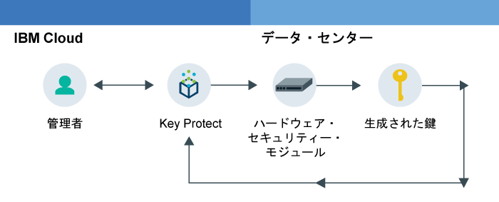

---

copyright:
  years: 2017
lastupdated: "2017-08-03"

---

{:shortdesc: .shortdesc}
{:codeblock: .codeblock}
{:screen: .screen}
{:new_window: target="_blank"}
{:pre: .pre}
{:tip: .tip}

# {{site.data.keyword.keymanagementserviceshort}} の概要

{{site.data.keyword.keymanagementservicelong}} を使用すると、さまざまなシナリオで鍵を管理できます。{: shortdesc}

## {{site.data.keyword.keymanagementserviceshort}} を使用する理由
{: #kp_reasons}

以下のようなシナリオで鍵を管理する必要が生じる場合があります。

<table>
  <tr>
    <th>シナリオ</th>
    <th>理由</th>
  </tr>
  <tr>
    <td>医療記録などの大量の機密データを個別リソースごとに暗号化する必要があります。</td>
    <td>{{site.data.keyword.keymanagementserviceshort}} サービスをストレージ・ソリューション ([{{site.data.keyword.objectstorageshort}} ](https://console.bluemix.net/docs/services/ObjectStorage/index.html "外部リンク・アイコン") など) と統合して、クラウド内の保存データを暗号化できます。各文書をそれぞれ異なる鍵で保護できるため、データをより細かく制御することができます。</td>
  </tr>
  <tr>
    <td>大企業の IT 管理者として、数多くのさまざまなサービス・オファリング用の鍵を統合、追跡、および回転させる必要があります。</td>
    <td>{{site.data.keyword.keymanagementserviceshort}} インターフェースは、複数の暗号化サービスの管理を簡素化します。このサービスを使用すると、鍵の管理や分類を 1 カ所で集中的に行うことも、プロジェクト別に鍵を分離して別々の {{site.data.keyword.Bluemix_short}} スペースに格納することもできます。</td>
  </tr>
  <tr>
    <td>データの保護方法に対するガバナンスを遵守する必要がある、業界 (財務や法律など) のセキュリティー管理者です。保護しているデータを危険にさらすことなく、鍵の制御アクセスを認可する必要があります。</td>
    <td>このサービスを使用すると、[異なる {{site.data.keyword.Bluemix_notm}} 役割を割り当てる](managing-keys.html#viewkeyassignments)ことによって、鍵を管理するためのユーザーのアクセス権限を制御できます。例えば、鍵の素材を表示せずに鍵の作成情報を表示する必要があるユーザーに対しては、読み取り専用アクセス権限を付与できます。</td>
  <tr>
    <td>開発者は、自己暗号化ストレージなどの既存のアプリケーションを {{site.data.keyword.keymanagementserviceshort}} に統合できます。また、サービスと統合する独自のアプリを開発することもできます。</td>
    <td>{{site.data.keyword.Bluemix_notm}} 上、またはその外部のアプリは、
{{site.data.keyword.keymanagementserviceshort}} API と統合できます。
独自の既存の鍵をご使用のアプリに使用することも可能です。</td>
  </tr>
  <tr>
    <td>開発チームは厳しいポリシーを定めており、14 日ごとに鍵を生成して回転させる手段が必要です。</td>
    <td>{{site.data.keyword.Bluemix_notm}} を使用すると、ハードウェア・セキュリティー・モジュール (HSM) から迅速に鍵を生成し、継続的にセキュリティーのニーズを満たすことができます。</td>
  </tr>
</table>

## {{site.data.keyword.keymanagementserviceshort}} の機能方法
{: #kp_how}

{{site.data.keyword.keymanagementservicelong_notm}} は、{{site.data.keyword.Bluemix_notm}} の役割と協調して、組織全体の暗号鍵を管理するのを支援します。

IT またはセキュリティーの管理者に必要とされる高度な許可は、監査員には必要がない可能性があります。アクセスを簡素化するために、{{site.data.keyword.keymanagementserviceshort}} を {{site.data.keyword.Bluemix_notm}} の役割にマップして、各役割がそれぞれ異なるビューのサービスを持つようにします。どのビューとアクセス・レベルが自分のニーズに最も適しているかを判断するには、[鍵およびアクセスの監査](managing-keys.html#viewkeyassignments)を参照してください。

次の図は、管理者、監査員、および開発者が、サービスで管理されている鍵とどのように相互作用できるかを示しています。

<dl>
  <dt>サービスの統合</dt>
    <dd>{{site.data.keyword.Bluemix_notm}} スペースの管理者は、暗号化のために鍵を管理します。</dd>
  <dt>監査</dt>
    <dd>監査員は鍵の使用を検査し、疑わしいアクティビティーを特定します。</dd>
  <dt>アプリ</dt>
    <dd>開発者は、アプリにコーディングする暗号化用の鍵を管理します。</dd>
</dl>

## {{site.data.keyword.keymanagementserviceshort}} アーキテクチャー
{: #kp_architecture}

{{site.data.keyword.keymanagementservicelong_notm}} は、業界で認められたテクノロジーで構成されています。

<dl>
  <dt>{{site.data.keyword.Bluemix_notm}} サーバー</dt>
    <dd>{{site.data.keyword.Bluemix_notm}} サーバーからの ID、プロジェクト、トークンにより、{{site.data.keyword.keymanagementserviceshort}} サービスはリソースを鍵にマップすることができます。</dd>
  <dt>{{site.data.keyword.keymanagementserviceshort}} の API</dt>
    <dd>{{site.data.keyword.keymanagementserviceshort}} REST API は、鍵の作成と管理を駆動します。サービスは暗号化されたマルチテナンシーを提供します。</dd>
  <dt>{{site.data.keyword.Bluemix_notm}} のユーザー・インターフェース</dt>
    <dd>{{site.data.keyword.keymanagementserviceshort}} のユーザー・インターフェース (UI) では、安全に鍵の処理を行えます。</dd>
  <dt>ハードウェア・セキュリティー・モジュール (HSM)</dt>
    <dd>{{site.data.keyword.IBM_notm}} データ・センターは、鍵を保護するためのハードウェアを舞台裏で提供しています。</dd>
  <dt>データベース・クラスター</dt>
    <dd>クラスター化されたデータベースを使用した豊富で安全な鍵の保管を期待できます。</dd>
</dl>

以下の図は、{{site.data.keyword.keymanagementserviceshort}} がハードウェア・セキュリティー・モジュールと連携して鍵を生成する方法と、サービスによる鍵の保管方法を対比して示しています。

