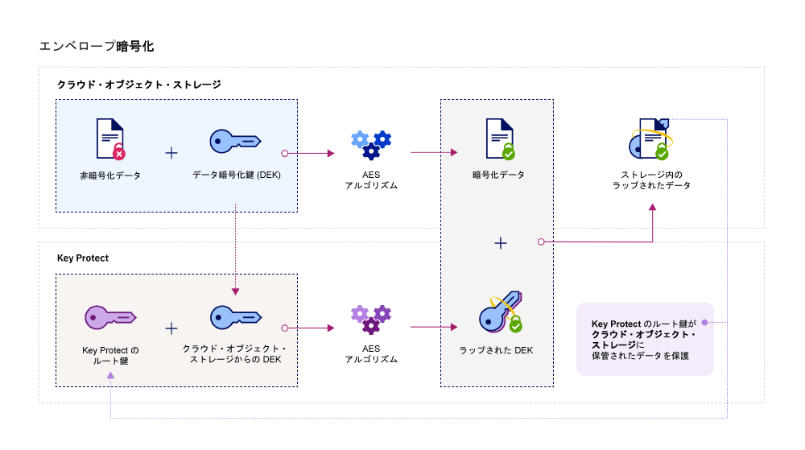

---

copyright:
  years: 2017
lastupdated: "2017-12-15"

---

{:shortdesc: .shortdesc}
{:codeblock: .codeblock}
{:screen: .screen}
{:new_window: target="_blank"}
{:pre: .pre}
{:tip: .tip}

# 統合
{: #integrations}

{{site.data.keyword.keymanagementservicefull}} を {{site.data.keyword.cloud_notm}} のデータおよびストレージのソリューションと統合すると、クラウド内の暗号化の管理に役立ちます。
{: shortdesc}

{{site.data.keyword.keymanagementserviceshort}} サービスをストレージ・ソリューション ([{{site.data.keyword.objectstorageshort}} ](/docs/services/ObjectStorage/index.html) など) と統合して、クラウド内の保存データを暗号化できます。 各文書をそれぞれ異なる鍵で保護できるため、データをより細かく制御することができます。 また、{{site.data.keyword.keymanagementserviceshort}} を使用して、以下のサービスに独自の暗号化を持ち込んで管理することもできます。

- [{{site.data.keyword.cos_full_notm}} ](/docs/services/cloud-object-storage/about-cos.html#about-ibm-cloud-object-storage)

## {{site.data.keyword.keymanagementservicelong_notm}} と {{site.data.keyword.cos_full_notm}}

{{site.data.keyword.keymanagementserviceshort}} サービスを使用して、{{site.data.keyword.cos_full_notm}} リソースに対してエンベロープ暗号化を実行できます。

### {{site.data.keyword.cos_full_notm}} の概要
{: #cos}

{{site.data.keyword.cos_full_notm}} は、非構造化データ用のクラウド・ストレージを提供します。非構造化データとは、ファイル、オーディオビジュアル・メディア、PDF、圧縮データ・アーカイブ、バックアップ・イメージ、アプリケーション成果物、ビジネス文書、その他のバイナリー・オブジェクトを指します。  

データ保全性と可用性を維持するために、{{site.data.keyword.cos_full_notm}} は、複数の地理的位置にわたる複数のストレージ・ノード間に、データをスライスし、バランスを取って、分散させます。単一のストレージ・ノードにはデータの完全なコピーは存在せず、ノードのサブセットが使用可能であれば、ネットワーク上でデータを十分に取り出すことができます。プロバイダー・サイドで暗号化が提供されているため、データは保存中も移動中も保護されています。ストレージを管理するには、バケットを作成し、{{site.data.keyword.cloud_notm}} コンソールを使用して、あるいは [{{site.data.keyword.cos_full_notm}}REST API](/docs/services/cloud-object-storage/api-reference/about-compatibility-api.html#about-the-cos-api) を使用してプログラムで、オブジェクトをインポートします。

詳しくは、[Getting Started with COS](/docs/services/cloud-object-storage/getting-started.html#getting-started-cli-) を参照してください。

## 仕組み
{: #kp_cos_how}

{{site.data.keyword.keymanagementserviceshort}} は {{site.data.keyword.cos_full_notm}} と統合して、データのセキュリティーを完全に管理できるように支援します。  

ユーザーがデータを {{site.data.keyword.cos_full_notm}} のインスタンスに移動すると、サービスは自動的にデータ暗号鍵 (DEK) を使用してオブジェクトを暗号化します。 {{site.data.keyword.cos_full_notm}} 内で、DEK はサービス内の、暗号化したリソースの近くに安全に保管されます。ユーザーがバケットにアクセスする必要がある場合、サービスはユーザーの許可を検査し、ユーザーのためにバケット内のオブジェクトを暗号化解除します。この暗号化モデルは、_プロバイダー管理の暗号化_ と呼ばれます。

_顧客管理の暗号化_ のセキュリティー上の利点を活用するには、{{site.data.keyword.keymanagementserviceshort}} サービスと統合することで、{{site.data.keyword.cos_full_notm}} 内の DEK にエンベロープ暗号化を追加します。{{site.data.keyword.keymanagementserviceshort}} を使用して、非常にセキュアなルート鍵をプロビジョンします。このルート鍵は、サービス内で管理するマスター鍵としての機能を果たします。{{site.data.keyword.cos_full_notm}} 内にバケットを作成する場合、バケットの作成時にエンベロープ暗号化を構成できます。この追加された保護は、{{site.data.keyword.keymanagementserviceshort}} 内で管理するルート鍵を使用して、バケットに関連付けられた DEK をラップ (つまり、暗号化) します。この手法は、_鍵ラッピング_ と呼ばれ、複数の AES アルゴリズムを使用して DEK のプライバシーおよび保全性を保護します。そのため、ユーザーは関連付けられたデータへのアクセスを制御するだけで済みます。

次の図は、{{site.data.keyword.keymanagementserviceshort}} を {{site.data.keyword.cos_full_notm}} と統合して、暗号鍵をさらにセキュアにする方法を示しています。

{{site.data.keyword.keymanagementserviceshort}} 内でエンベロープ暗号化がどのように機能するかについて詳しくは、[エンベロープ暗号化](/docs/services/keymgmt/keyprotect_envelope.html)を参照してください。

## サービス間のアクセス権限の付与
{: #grant_access}

{{site.data.keyword.cos_full_notm}} サービス・インスタンスと {{site.data.keyword.keymanagementserviceshort}} サービス・インスタンスの間でアクセス権限を付与する必要がある場合、{{site.data.keyword.iamlong}} ダッシュボードを使用して許可を設定できます。許可は、サービス間のアクセス・ポリシーを有効にするので、COS 内のストレージ・バケットを、{{site.data.keyword.keymanagementserviceshort}} でプロビジョンされたルート鍵と関連付けることが可能になります。

許可を作成するには、以下の手順を実行します。

1. メニュー・バーで、**「管理」** &gt; **「アカウント」** &gt; **「ID およびアクセス」** をクリックして、**「許可」**を選択します。 
2. **「許可の作成」**をクリックします。
3. 許可のソースとターゲットを選択します。
 
    a. **「ソース・サービス」**に、**「{{site.data.keyword.cos_full_notm}}」**を選択します。

    b. **「ターゲット・サービス」**に、**「{{site.data.keyword.keymanagementservicelong_notm}}」**を選択します。 
4. サービス間に読み取り専用アクセス権限を付与するには、**「読者」**チェック・ボックスを選択します。

_読者_ の許可がある場合、{{site.data.keyword.cos_full_notm}} のインスタンスは、{{site.data.keyword.keymanagementserviceshort}} の指定のインスタンス内でプロビジョンされたルート鍵を表示できます。バケットの作成時に、バケットを指定の {{site.data.keyword.keymanagementserviceshort}} ルート鍵と関連付けることができます。
5. **「許可」**をクリックします。

サービスの許可について詳しくは、[IAM 資料](/docs/iam/authorizations.html#serviceauth)を参照してください。 

## ストレージ・バケットへのエンベロープ暗号化の追加
{: #kp_cos_envelope}

[{{site.data.keyword.keymanagementserviceshort}}](/docs/services/keymgmt/keyprotect_create_keys.html) でルート鍵を指定し、サービス間のアクセス権限を付与した後、{{site.data.keyword.cos_full_notm}} GUI を使用して、指定のストレージ・バケットに対してエンベロープ暗号化を有効にすることができます。

**注:** エンベロープ暗号化は現在、米国南部地域でプロビジョンされたバケットにのみ使用できます。ストレージ・バケットに対して拡張構成オプションを有効にするには、必ず COS と {{site.data.keyword.keymanagementserviceshort}} サービス・インスタンスの間にサービス間ポリシーが存在する必要があります。

ストレージ・バケットにエンベロープ暗号化を追加するには、以下の手順を実行します。

1. {{site.data.keyword.cos_full_notm}} ダッシュボードで、**「バケットの作成 (Create bucket)」**をクリックします。
2. バケットの詳細を指定します。
3. **「拡張構成」**セクションで、**「Key Protect 鍵の追加 (Add {{site.data.keyword.keymanagementserviceshort}} Keys)」**を選択します。
4. {{site.data.keyword.keymanagementserviceshort}} サービス・インスタンスのリストから、鍵ラッピングに使用するルート鍵が入っているインスタンスを選択します。
5. **「鍵の名前 (Key Name)」**に、ルート鍵の別名を選択します。
6. **「作成」**をクリックして、バケットの作成を確認します。

{{site.data.keyword.cos_full_notm}} GUI から、{{site.data.keyword.keymanagementserviceshort}} ルート鍵で保護されたバケットを表示できます。

## {{site.data.keyword.keymanagementserviceshort}} API メソッド
{: #api_methods}

背景で、{{site.data.keyword.keymanagementserviceshort}} API は、鍵ラッピング (つまり、エンベロープ暗号化) プロセスを駆動します。  

次の表に、エンベロープ暗号化の追加または削除が呼び出されたときの API メソッドをリストします。

<table>
  <tr>
    <th>メソッド</th>
    <th>説明</th>
  </tr>
  <tr>
    <td><code>POST /keys/{root_key_ID}?action=wrap</code></td>
    <td><a href="/docs/services/keymgmt/keyprotect_wrap_keys.html">データ暗号鍵をラップ (暗号化) します</a></td>
  </tr>
  <tr>
    <td><code>POST /keys/{root_key_ID}?action=unwrap</code></td>
    <td><a href="/docs/services/keymgmt/keyprotect_unwrap_keys.html">データ暗号鍵をアンラップ (暗号化解除) します</a></td>
  </tr>
  <caption style="caption-side:bottom;">表 1. {{site.data.keyword.keymanagementserviceshort}} API メソッドの説明</caption>
</table>

{{site.data.keyword.keymanagementserviceshort}} のプログラムでの鍵の管理について詳しくは、[{{site.data.keyword.keymanagementserviceshort}} API リファレンス資料](https://console.ng.bluemix.net/apidocs/639)に記載されているコード・サンプルを確認してください。

