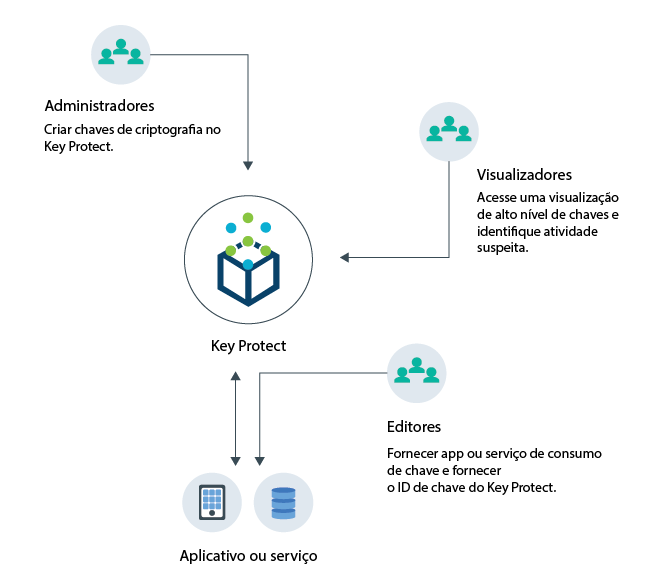
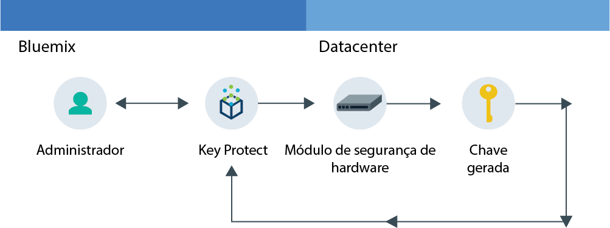
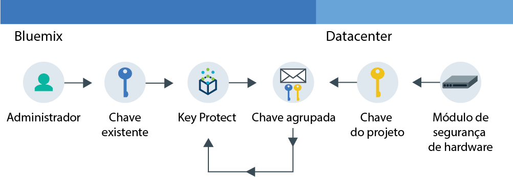

---

copyright:
  years: 2017
lastupdated: "2017-09-21"

---

{:shortdesc: .shortdesc}
{:codeblock: .codeblock}
{:screen: .screen}
{:new_window: target="_blank"}
{:pre: .pre}
{:tip: .tip}

# Sobre {{site.data.keyword.keymanagementserviceshort}}

O {{site.data.keyword.keymanagementservicefull}} ajuda a provisionar chaves criptografadas para apps em serviços {{site.data.keyword.Bluemix_notm}}. Conforme você gerencia o ciclo de vida de suas chaves, é possível se beneficiar por saber que as suas chaves estão asseguradas pelos módulos de hardware baseados em nuvem (HSMs) certificados pelo FIPS-140 que protegem contra furto de informações.
{: shortdesc}

## Casos de uso do {{site.data.keyword.keymanagementserviceshort}}
{: #kp_reasons}

A seguir estão os casos de uso para o {{site.data.keyword.keymanagementserviceshort}}:

<table>
  <tr>
    <th>Caso de uso</th>
    <th>Solução</th>
  </tr>
  <tr>
    <td>Você precisa criptografar altos volumes de dados sensíveis, tais como registros médicos,
por recurso individual.</td>
    <td>É possível integrar o serviço {{site.data.keyword.keymanagementserviceshort}} com soluções de armazenamento, como [{{site.data.keyword.objectstorageshort}} ](https://console.bluemix.net/docs/services/ObjectStorage/index.html), para criptografar seus dados em repouso na nuvem. Cada documento pode ser protegido por uma chave
diferente, portanto, você tem controle granular dos seus dados.</td>
  </tr>
  <tr>
    <td>Como um administrador de TI de uma grande empresa, você precisa integrar, controlar e girar chaves para muitas ofertas de serviços diferentes.</td>
    <td>A interface do {{site.data.keyword.keymanagementserviceshort}}
simplifica o gerenciamento dos diversos serviços de criptografia. Com esse serviço, é possível gerenciar e classificar chaves em um local
centralizado ou separar as chaves por projeto e armazená-las em espaços diferentes
do {{site.data.keyword.Bluemix_short}}.</td>
  </tr>
  <tr>
    <td>Você é um administrador de segurança em um segmento de mercado, como finanças ou jurídico, que deve aderir ao controle sobre como os dados
são protegidos. É necessário conceder acesso controlado às chaves sem comprometer os dados
que elas protegem.</td>
    <td>Com o serviço, é possível controlar o acesso de usuário para gerenciar chaves [designando diferentes funções do Identity and Access Management](/docs/services/keyprotect_manage_access.html#roles). Por exemplo, é possível conceder acesso somente leitura aos usuários
que precisam visualizar informações sobre a criação da chave sem visualizar o material da chave.</td>
  <tr>
    <td>Como um desenvolvedor, é possível integrar aplicativos preexistentes, como armazenamento
autocriptografado, ao {{site.data.keyword.keymanagementserviceshort}}. Também é possível desenvolver seus próprios apps que se integram ao serviço.</td>
    <td>Apps dentro ou fora do {{site.data.keyword.Bluemix_notm}} podem ser integrados às APIs do {{site.data.keyword.keymanagementserviceshort}}. É possível usar suas próprias chaves existentes em seus apps. </td>
  </tr>
  <tr>
    <td>Sua equipe de desenvolvimento tem políticas rigorosas e
você precisa de uma maneira de gerar e girar chaves a cada 14 dias.</td>
    <td>Com o {{site.data.keyword.Bluemix_notm}},
é possível gerar chaves rapidamente de um módulo de segurança de hardware (HSM) para atender às suas necessidades de segurança em
andamento.</td>
  </tr>
  <caption style="caption-side:bottom;">Tabela 1. Variáveis necessárias para a inclusão de chaves por meio da API do {{site.data.keyword.keymanagementserviceshort}}</caption>
</table>

## Como o {{site.data.keyword.keymanagementserviceshort}}
funciona
{: #kp_how}

O {{site.data.keyword.keymanagementservicelong_notm}} ajuda a gerenciar chaves de criptografia em sua organização por meio do alinhamento com as funções do {{site.data.keyword.Bluemix_notm}} Identity and Access Management.

Um
administrador de TI ou de segurança precisa de permissões avançadas que um auditor pode não
precisar. Para simplificar o acesso, o {{site.data.keyword.keymanagementserviceshort}} é mapeado para as funções do {{site.data.keyword.Bluemix_notm}} Identity and Access Management para que cada função tenha uma visualização diferente do serviço. Para ajudar a orientar qual visualização e nível de acesso melhor se adequa às suas necessidades, veja [Gerenciando usuários e acesso](/docs/services/keymgmt/keyprotect_manage_access.html#roles).

O diagrama a seguir mostra como os administradores, visualizadores e editores podem interagir com as chaves que são gerenciadas no serviço.

<dl>
  <dt>Integração de Serviço</dt>
    <dd>Os administradores do seu espaço do {{site.data.keyword.Bluemix_notm}} gerenciam as chaves para a criptografia.</dd>
  <dt>Visualizar</dt>
    <dd>Os visualizadores acessam uma visualização de alto nível de chaves e identificam atividades suspeitas.</dd>
  <dt>Aplicativos</dt>
    <dd>Os editores gerenciam as chaves para a criptografia que eles codificam nos apps.</dd>
</dl>

## Arquitetura do {{site.data.keyword.keymanagementserviceshort}}
{: #kp_architecture}

O {{site.data.keyword.keymanagementservicelong_notm}}
é composto de tecnologias aceitas pelo segmento de mercado.

<dl>
  <dt>Servidor {{site.data.keyword.Bluemix_notm}}</dt>
    <dd>A identidade, os projetos e seus tokens do servidor {{site.data.keyword.Bluemix_notm}} permitem que o serviço {{site.data.keyword.keymanagementserviceshort}} mapeie recursos para chaves.</dd>
  <dt>API para o {{site.data.keyword.keymanagementserviceshort}}</dt>
    <dd>A API de REST do {{site.data.keyword.keymanagementserviceshort}}
impulsiona a criação e o gerenciamento de chaves. O serviço fornece ocupação variada criptografada.</dd>
  <dt>Interface com o usuário no {{site.data.keyword.Bluemix_notm}}</dt>
    <dd>Com a interface com o usuário (UI) do {{site.data.keyword.keymanagementserviceshort}}, é possível trabalhar com suas chaves de forma segura.</dd>
  <dt>Hardware security module (HSM)</dt>
    <dd>Nos bastidores, os data centers da {{site.data.keyword.cloud_notm}} fornecem o hardware para proteger suas chaves.</dd>
  <dt>Cluster do banco de dados</dt>
    <dd>É possível contar com armazenamento seguro e redundante de suas
chaves com um banco de dados em cluster.</dd>
</dl>

Os diagramas a seguir mostram como o {{site.data.keyword.keymanagementserviceshort}}
trabalha com os módulos de segurança de hardware para gerar chaves
comparado a como o serviço armazena as chaves.

