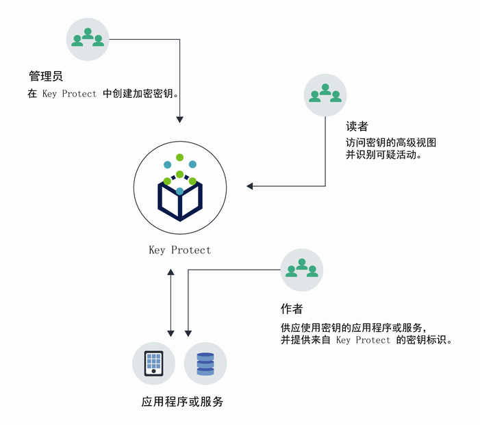
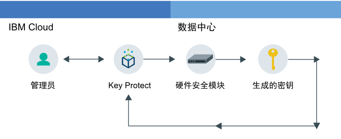
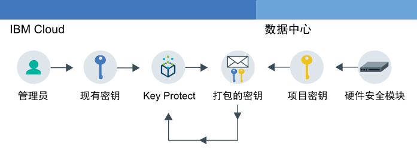

---

copyright:
  years: 2017
lastupdated: "2017-11-08"

---

{:shortdesc: .shortdesc}
{:codeblock: .codeblock}
{:screen: .screen}
{:new_window: target="_blank"}
{:pre: .pre}
{:tip: .tip}

# 关于 {{site.data.keyword.keymanagementserviceshort}}

{{site.data.keyword.keymanagementservicefull}} 可帮助您为 {{site.data.keyword.cloud_notm}} 服务中的应用程序供应加密的密钥。在管理密钥的生命周期时，您应当了解，密钥受已通过 FIPS 140-2 Level 2 认证的基于云的硬件安全模块 (HSM) 的保护，可防止信息被盗。
{: shortdesc}

## {{site.data.keyword.keymanagementserviceshort}} 用例
{: #kp_reasons}

以下是 {{site.data.keyword.keymanagementserviceshort}} 的用例：

<table>
  <tr>
    <th>用例</th>
    <th>解决方案</th>
  </tr>
  <tr>
    <td>您需要按单个资源对大量敏感数据进行加密，如医疗记录。</td>
    <td>您可以将 {{site.data.keyword.keymanagementserviceshort}} 服务与存储解决方案（如 [{{site.data.keyword.objectstorageshort}} ](https://console.bluemix.net/docs/services/ObjectStorage/index.html)）相集成，以便对云中驻留的数据进行加密。可以使用不同的密钥保护每个文档，这样就可以精确控制数据。</td>
  </tr>
  <tr>
    <td>作为大公司的 IT 管理员，您需要对许多不同服务产品的密钥进行集成、跟踪和轮询。</td>
    <td>{{site.data.keyword.keymanagementserviceshort}} 界面可以简化对多个加密服务的管理。借助该服务，您可以在一个集中的位置对密钥进行管理和排序，或按项目分隔密钥并将其存储在不同 {{site.data.keyword.cloud_notm}} 空间中。</td>
  </tr>
  <tr>
    <td>您是某行业（如金融或法律）的安全管理员，必须遵守数据保护监管规定。您既需要授予有控制的密钥访问权，又不能放松对密钥所保护的数据进行安全防护。</td>
    <td>借助该服务，可以通过[指定不同的 Identity and Access Management 角色](/docs/services/keyprotect_manage_access.html#roles)来控制用户对管理密钥的访问权。例如，对需要查看密钥创建信息但不需要查看密钥资料的用户，您可以授予只读访问权。</td>
  <tr>
    <td>作为开发人员，您可以将已有的应用程序（例如，自加密存储器）集成到 {{site.data.keyword.keymanagementserviceshort}}。也可以开发您自己的应用程序并与该服务集成。</td>
    <td>{{site.data.keyword.cloud_notm}} 上的或其之外的应用程序可以与 {{site.data.keyword.keymanagementserviceshort}} API 集成。您可以将您自己的现有密钥用于应用程序。</td>
  </tr>
  <tr>
    <td>您的开发团队制定了严格的策略，每 14 天便需要生成和轮询密钥。</td>
    <td>借助 {{site.data.keyword.keymanagementserviceshort}}，可快速从硬件安全模块 (HSM) 生成密钥，以持续满足安全需求。</td>
  </tr>
  <caption style="caption-side:bottom;">表 1. 通过 {{site.data.keyword.keymanagementserviceshort}} API 添加密钥所需的变量</caption>
</table>

## {{site.data.keyword.keymanagementserviceshort}} 的工作原理
{: #kp_how}

{{site.data.keyword.keymanagementservicelong_notm}} 与 {{site.data.keyword.iamshort}} 角色相一致，可以帮助您管理整个组织中的加密密钥。

IT 或安全管理员需要高级权限，而审计员可能不需要。为了简化访问，{{site.data.keyword.keymanagementserviceshort}} 映射到 {{site.data.keyword.iamshort}} 角色，以便每个角色都能查看该服务的不同方面。要获取有关哪些视图和访问权级别最符合您需求的指南，请参阅[管理用户和访问权](/docs/services/keymgmt/keyprotect_manage_access.html#roles)。

下图说明了管理员、查看者和编辑者如何与在该服务中管理的密钥进行交互。

<dl>
  <dt>服务集成</dt>
    <dd>{{site.data.keyword.cloud_notm}} 空间的管理员管理加密的密钥。</dd>
  <dt>视图</dt>
    <dd>查看者访问密钥的高级视图并识别可疑活动。
</dd>
  <dt>应用程序</dt>
    <dd>编辑者管理其编码到应用程序的密码的密钥。</dd>
</dl>

## {{site.data.keyword.keymanagementserviceshort}} 体系结构
{: #kp_architecture}

{{site.data.keyword.keymanagementservicelong_notm}} 包含行业认可的技术。

<dl>
  <dt>{{site.data.keyword.cloud_notm}} 服务器</dt>
    <dd>通过 {{site.data.keyword.cloud_notm}} 服务器中的身份、项目及其令牌，{{site.data.keyword.keymanagementserviceshort}} 服务可将资源映射到密钥。</dd>
  <dt>用于 {{site.data.keyword.keymanagementserviceshort}} 的 API</dt>
    <dd>{{site.data.keyword.keymanagementserviceshort}} REST API 可推动密钥创建和管理。该服务提供加密多租户。</dd>
  <dt>{{site.data.keyword.cloud_notm}} 中的用户界面</dt>
    <dd>通过 {{site.data.keyword.keymanagementserviceshort}} 用户界面 (UI)，您可以安全地使用密钥。</dd>
  <dt>硬件安全模块 (HSM)</dt>
    <dd>{{site.data.keyword.cloud_notm}} 数据中心在后台提供硬件来保护密钥。</dd>
  <dt>数据库集群</dt>
    <dd>通过集群数据库，您可以使用冗余的安全密钥存储器。</dd>
</dl>

以下图形对 {{site.data.keyword.keymanagementserviceshort}} 如何使用硬件安全模块来生成密钥与存储密钥进行了比较。

