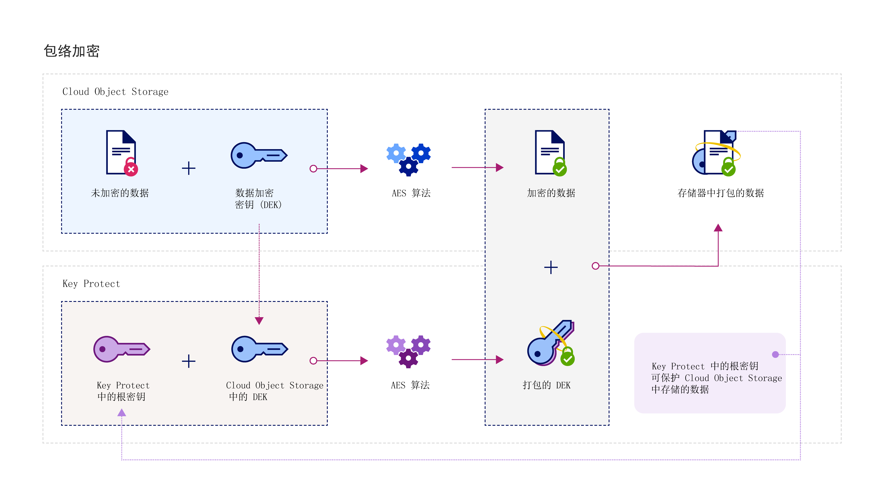

---

copyright:
  years: 2017
lastupdated: "2017-12-15"

---

{:shortdesc: .shortdesc}
{:codeblock: .codeblock}
{:screen: .screen}
{:new_window: target="_blank"}
{:pre: .pre}
{:tip: .tip}

# 集成
{: #integrations}

{{site.data.keyword.keymanagementservicefull}} 与 {{site.data.keyword.cloud_notm}} 数据和存储解决方案相集成，可帮助您管理云中的加密。
{: shortdesc}

您可以将 {{site.data.keyword.keymanagementserviceshort}} 服务与存储解决方案（如 [{{site.data.keyword.objectstorageshort}} ](/docs/services/ObjectStorage/index.html)）相集成，以便对云中驻留的数据进行加密。可以使用不同的密钥保护每个文档，这样就可以精确控制数据。您还可以使用 {{site.data.keyword.keymanagementserviceshort}} 向以下服务提供自己的加密并对这些加密进行管理：

- [{{site.data.keyword.cos_full_notm}} ](/docs/services/cloud-object-storage/about-cos.html#about-ibm-cloud-object-storage)

## {{site.data.keyword.keymanagementservicelong_notm}} 和 {{site.data.keyword.cos_full_notm}}

可以使用 {{site.data.keyword.keymanagementserviceshort}} 服务对 {{site.data.keyword.cos_full_notm}} 资源执行包络加密。

### 关于 {{site.data.keyword.cos_full_notm}}
{: #cos}

{{site.data.keyword.cos_full_notm}} 用于为非结构化数据提供云存储。非结构化数据是指文件、音频/视频媒体、PDF、压缩的数据归档、备份映像、应用程序工件、业务文档或其他任何二进制对象。  

为了保持数据完整性和可用性，{{site.data.keyword.cos_full_notm}} 会对数据执行分片和均衡操作，还会将数据分散到跨多个地理位置的存储节点。数据完整副本不会位于任何单个存储节点中，只需要有一部分节点可用，就可以在网络上完整检索到数据。提供了提供者端加密，以确保您的静态和动态数据的安全。要管理存储器，请使用 {{site.data.keyword.cloud_notm}} 控制台或使用 [{{site.data.keyword.cos_full_notm}} REST API](/docs/services/cloud-object-storage/api-reference/about-compatibility-api.html#about-the-cos-api) 以编程方式创建存储区和导入对象。

有关更多信息，请参阅 [COS 入门](/docs/services/cloud-object-storage/getting-started.html#getting-started-cli-)。

## 工作原理
{: #kp_cos_how}

{{site.data.keyword.keymanagementserviceshort}} 与 {{site.data.keyword.cos_full_notm}} 相集成，可帮助您完全控制数据安全性。  

将数据移入 {{site.data.keyword.cos_full_notm}} 的实例时，服务会自动使用数据加密密钥 (DEK) 来加密对象。在 {{site.data.keyword.cos_full_notm}} 中，DEK 会安全地存储在服务中，靠近它们所加密的资源。需要访问存储区时，服务会检查您的用户许可权，并对存储区内的对象进行解密。此加密模型称为_提供者管理的加密_。

要利用_客户管理的加密_的安全优势，可以通过在 {{site.data.keyword.cos_full_notm}} 中与 {{site.data.keyword.keymanagementserviceshort}} 服务相集成，将包络加密添加到 DEK。通过 {{site.data.keyword.keymanagementserviceshort}}，可以供应高度安全的根密钥，这些密钥充当您在服务中控制的主密钥。在 {{site.data.keyword.cos_full_notm}} 中创建存储区时，可以为该存储区配置包络加密。这一添加的保护功能将使用您在 {{site.data.keyword.keymanagementserviceshort}} 中管理的根密钥来打包（或加密）与该存储区关联的 DEK。这种做法称为_密钥打包_，使用多种 AES 算法来保护 DEK 的隐私性和完整性，使得只有您可控制对其关联数据的访问权。

下图显示 {{site.data.keyword.keymanagementserviceshort}} 如何与 {{site.data.keyword.cos_full_notm}} 集成以进一步保护加密密钥。

要了解有关包络加密在 {{site.data.keyword.keymanagementserviceshort}} 中的工作方式的更多信息，请参阅[包络加密](/docs/services/keymgmt/keyprotect_envelope.html)。

## 授予服务之间的访问权
{: #grant_access}

需要授予 {{site.data.keyword.cos_full_notm}} 与 {{site.data.keyword.keymanagementserviceshort}} 服务实例之间的访问权时，可以使用 {{site.data.keyword.iamlong}} 仪表板来设置授权。授权将启用服务到服务访问策略，以便可以将 COS 中的存储区与 {{site.data.keyword.keymanagementserviceshort}} 中供应的根密钥相关联。

要创建授权，请执行以下操作：

1. 在菜单栏中，单击**管理** &gt; **帐户** &gt; **身份和访问权**，然后选择**授权**。 
2. 单击**创建授权**。
3. 选择授权的源和目标。
 
    a. 对于**源服务**，选择 **{{site.data.keyword.cos_full_notm}}**。

    b. 对于**目标服务**，选择 **{{site.data.keyword.keymanagementservicelong_notm}}**。 
4. 要授予服务之间的只读访问权，请选中**读者**复选框。

借助_读者_许可权，{{site.data.keyword.cos_full_notm}} 实例可以浏览在指定的 {{site.data.keyword.keymanagementserviceshort}} 实例中供应的根密钥。创建存储区期间，可以将存储区与指定的 {{site.data.keyword.keymanagementserviceshort}} 根密钥相关联。
5. 单击**授权**。

要了解有关服务授权的更多信息，请参阅 [IAM 文档](/docs/iam/authorizations.html#serviceauth)。 

## 向存储区添加包络加密
{: #kp_cos_envelope}

[指定 {{site.data.keyword.keymanagementserviceshort}} 中的根密钥](/docs/services/keymgmt/keyprotect_create_keys.html)并授予服务之间的访问权后，可以使用 {{site.data.keyword.cos_full_notm}} GUI 对指定的存储区启用包络加密。

**注：**目前，包络加密仅可用于在美国南部区域供应的存储区。要对存储区启用高级配置选项，请确保 COS 与 {{site.data.keyword.keymanagementserviceshort}} 服务实例之间存在服务到服务策略。

要向存储区添加包络加密，请执行以下操作：

1. 在 {{site.data.keyword.cos_full_notm}} 仪表板中，单击**创建存储区**。
2. 指定存储区的详细信息。
3. 在**高级配置**部分中，选择**添加 {{site.data.keyword.keymanagementserviceshort}} 密钥**。
4. 从 {{site.data.keyword.keymanagementserviceshort}} 服务实例列表中，选择包含要用于密钥打包的根密钥的实例。
5. 对于**密钥名称**，选择根密钥的别名。
6. 单击**创建**以确认创建存储区。

在 {{site.data.keyword.cos_full_notm}} GUI 中，可以浏览受 {{site.data.keyword.keymanagementserviceshort}} 根密钥保护的存储区。

## {{site.data.keyword.keymanagementserviceshort}} API 方法
{: #api_methods}

{{site.data.keyword.keymanagementserviceshort}} API 在后台驱动密钥打包（或包络加密）过程。  

下表列出了可调用来添加或除去包络加密的 API 方法：

<table>
  <tr>
    <th>方法</th>
    <th>描述</th>
  </tr>
  <tr>
    <td><code>POST /keys/{root_key_ID}?action=wrap</code></td>
    <td><a href="/docs/services/keymgmt/keyprotect_wrap_keys.html">打包（加密）数据加密密钥</a></td>
  </tr>
  <tr>
    <td><code>POST /keys/{root_key_ID}?action=unwrap</code></td>
    <td><a href="/docs/services/keymgmt/keyprotect_unwrap_keys.html">解包（解密）数据加密密钥</a></td>
  </tr>
  <caption style="caption-side:bottom;">表 1. {{site.data.keyword.keymanagementserviceshort}} API 方法的描述</caption>
</table>

要了解有关在 {{site.data.keyword.keymanagementserviceshort}} 中以编程方式管理密钥的更多信息，请查看 [{{site.data.keyword.keymanagementserviceshort}} API 参考文档](https://console.ng.bluemix.net/apidocs/639)，以获取代码样本。

