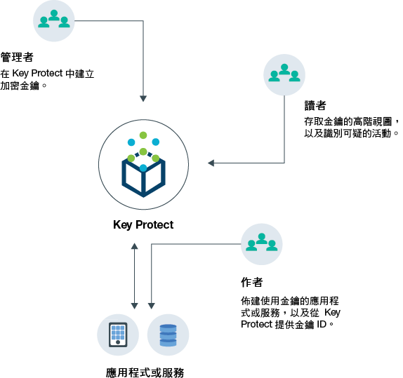
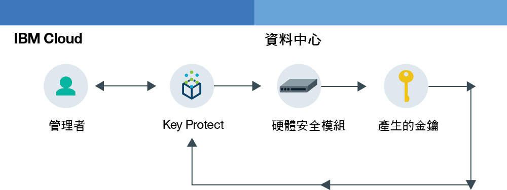
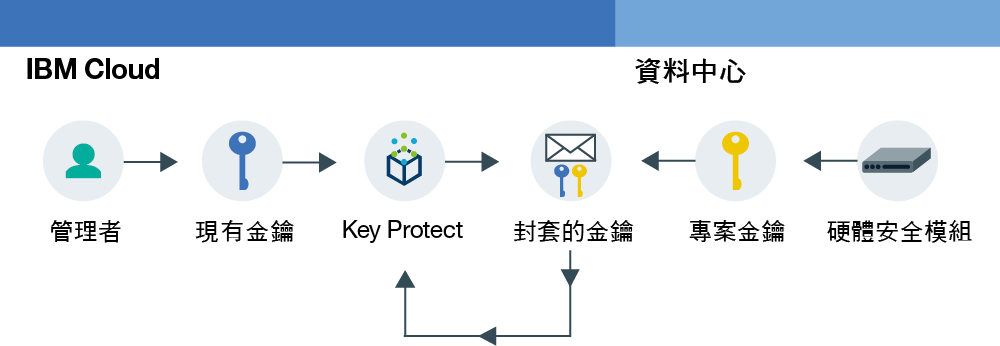

---

copyright:
  years: 2017
lastupdated: "2017-08-03"

---

{:shortdesc: .shortdesc}
{:codeblock: .codeblock}
{:screen: .screen}
{:new_window: target="_blank"}
{:pre: .pre}
{:tip: .tip}

# 關於 {{site.data.keyword.keymanagementserviceshort}}

使用 {{site.data.keyword.keymanagementservicelong}}，您可以在各種情況下管理金鑰。
{: shortdesc}

## 使用 {{site.data.keyword.keymanagementserviceshort}} 的理由
{: #kp_reasons}

您可能想要在下列情境中管理金鑰：

<table>
  <tr>
    <th>情境</th>
    <th>原因</th>
  </tr>
  <tr>
    <td>您需要將大量的機密資料（例如醫療記錄）依個別資源進行加密。</td>
    <td>您可以整合 {{site.data.keyword.keymanagementserviceshort}} 服務與儲存空間解決方案，例如 [{{site.data.keyword.objectstorageshort}} ](https://console.bluemix.net/docs/services/ObjectStorage/index.html "外部鏈結圖示")，來將您靜置在雲端的資料加密。每份文件可以用不同金鑰保護，因此您可以精細地控制資料。</td>
  </tr>
  <tr>
    <td>身為大公司的 IT 管理者，您需要針對許多不同的服務供應項目，整合、追蹤和輪替金鑰。</td>
    <td>{{site.data.keyword.keymanagementserviceshort}} 介面能簡化多重加密服務的管理。使用此服務，您可以在一個中央位置管理及排序金鑰，或者可以依專案隔離金鑰，並將它們存放在不同的 {{site.data.keyword.Bluemix_short}} 空間中。</td>
  </tr>
  <tr>
    <td>您是業界（例如財務或法務）的安全管理者，必須遵守對於資料保護方式的治理。您需要授與受控制的金鑰存取，而不危害它保護的資料。</td>
    <td>使用此服務，您可以藉由[指派不同的 {{site.data.keyword.Bluemix_notm}} 角色](managing-keys.html#viewkeyassignments)，控制管理金鑰的使用者存取權。例如，您可以授與唯讀存取給需要檢視金鑰建立資訊而不必檢視金鑰資料的使用者。</td>
  <tr>
    <td>身為開發人員的您可以將每個現有的應用程式（例如自行加密儲存空間）整合至 {{site.data.keyword.keymanagementserviceshort}}。您也可以自行開發與服務整合的應用程式。</td>
    <td>{{site.data.keyword.Bluemix_notm}} 上或外部的應用程式可與 {{site.data.keyword.keymanagementserviceshort}} API 整合。您可以對應用程式使用您自己的現有金鑰。</td>
  </tr>
  <tr>
    <td>您的開發團隊具有嚴格原則，而且您需要一種每 14 天產生並輪替金鑰的方式。</td>
    <td>使用 {{site.data.keyword.Bluemix_notm}}，您可以從硬體安全模組 (HSM) 快速產生金鑰，以符合您的進行中安全需求。</td>
  </tr>
</table>

## {{site.data.keyword.keymanagementserviceshort}} 如何運作
{: #kp_how}

{{site.data.keyword.keymanagementservicelong_notm}} 可藉由與 {{site.data.keyword.Bluemix_notm}} 角色一致，協助您管理組織裡的加密金鑰。

IT 或安全管理者需要進階許可權，審核員則可能不需要這些。為了簡化存取，{{site.data.keyword.keymanagementserviceshort}} 會對應至
{{site.data.keyword.Bluemix_notm}} 角色，以便每個角色有不同的服務視圖。為了協助指引哪個視圖及存取層次最適合您的需要，請參閱[審核金鑰及存取](managing-keys.html#viewkeyassignments)。

下圖顯示管理者、審核員及開發人員如何與服務中管理的金鑰互動。

<dl>
  <dt>服務整合</dt>
    <dd>{{site.data.keyword.Bluemix_notm}} 空間的管理者會管理加密用的金鑰。</dd>
  <dt>審核</dt>
    <dd>審核員會檢查金鑰的使用情形，以及識別可疑的活動。</dd>
  <dt>應用程式</dt>
    <dd>開發人員會管理適用於他們編入應用程式之加密法的金鑰。</dd>
</dl>

## {{site.data.keyword.keymanagementserviceshort}} 架構
{: #kp_architecture}

{{site.data.keyword.keymanagementservicelong_notm}} 是由業界接受的技術組成。

<dl>
  <dt>{{site.data.keyword.Bluemix_notm}} 伺服器</dt>
    <dd>來自 {{site.data.keyword.Bluemix_notm}} 的身分、專案及其記號，可讓 {{site.data.keyword.keymanagementserviceshort}} 服務將資源對映至金鑰。</dd>
  <dt>{{site.data.keyword.keymanagementserviceshort}} 的 API</dt>
    <dd>{{site.data.keyword.keymanagementserviceshort}} REST API 可促使金鑰的建立及管理。服務提供加密的多承租戶。</dd>
  <dt>{{site.data.keyword.Bluemix_notm}} 中的使用者介面</dt>
    <dd>搭配 {{site.data.keyword.keymanagementserviceshort}} 使用者介面，您可以安全地使用金鑰。</dd>
  <dt>硬體安全模組 (HSM)</dt>
    <dd>{{site.data.keyword.IBM_notm}} 資料中心會在幕後提供硬體來保護您的金鑰。</dd>
  <dt>資料庫叢集</dt>
    <dd>您可以藉由叢集資料庫，依靠金鑰的備用及安全儲存。</dd>
</dl>

下列圖表顯示 {{site.data.keyword.keymanagementserviceshort}} 如何使用硬體安全模組來產生金鑰與服務如何儲存金鑰的對比。

