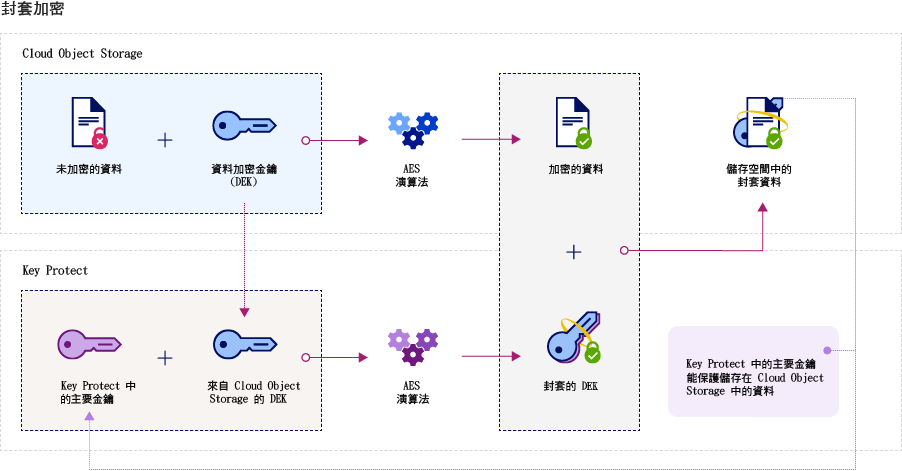

---

copyright:
  years: 2017
lastupdated: "2017-12-15"

---

{:shortdesc: .shortdesc}
{:codeblock: .codeblock}
{:screen: .screen}
{:new_window: target="_blank"}
{:pre: .pre}
{:tip: .tip}

# 整合
{: #integrations}

{{site.data.keyword.keymanagementservicefull}} 與 {{site.data.keyword.cloud_notm}} 資料及儲存空間解決方案整合，以協助您在雲端中管理加密。
{: shortdesc}

您可以整合 {{site.data.keyword.keymanagementserviceshort}} 服務與儲存空間解決方案，例如 [{{site.data.keyword.objectstorageshort}} ](/docs/services/ObjectStorage/index.html)，來將您靜置在雲端的資料加密。每份文件可以用不同金鑰保護，因此您可以精細地控制資料。您也可以使用 {{site.data.keyword.keymanagementserviceshort}}，將您自己的加密帶入下列服務並進行管理：

- [{{site.data.keyword.cos_full_notm}} ](/docs/services/cloud-object-storage/about-cos.html#about-ibm-cloud-object-storage)

## {{site.data.keyword.keymanagementservicelong_notm}} 及 {{site.data.keyword.cos_full_notm}}

您可以使用 {{site.data.keyword.keymanagementserviceshort}} 服務，對 {{site.data.keyword.cos_full_notm}} 資源執行封套加密。

### 關於 {{site.data.keyword.cos_full_notm}}
{: #cos}

{{site.data.keyword.cos_full_notm}} 為非結構化資料提供雲端儲存空間。非結構化資料指的是檔案、視聽媒體、PDF、壓縮的資料保存檔、備份映像檔、應用程式構件、商業文件或任何其他二進位物件。  

為了維護資料完整性及可用性，{{site.data.keyword.cos_full_notm}} 會切割、平衡資料，並將其分散至多個地理位置的儲存節點。任何單一儲存節點中都沒有完整的資料副本，只需要使用一部分的節點，如此您就可以完整擷取網路上的資料。提供了提供者端加密，因此您的靜置及進行中資料受到保護。若要管理儲存空間，請使用 {{site.data.keyword.cloud_notm}} 主控台或使用 [{{site.data.keyword.cos_full_notm}} REST API](/docs/services/cloud-object-storage/api-reference/about-compatibility-api.html#about-the-cos-api) 透過程式設計方式，來建立儲存區以及匯入物件。

如需相關資訊，請參閱[開始使用 COS](/docs/services/cloud-object-storage/getting-started.html#getting-started-cli-)。

## 如何運作
{: #kp_cos_how}

{{site.data.keyword.keymanagementserviceshort}} 與 {{site.data.keyword.cos_full_notm}} 整合，以協助您完全控制資料安全。  

在您將資料移至 {{site.data.keyword.cos_full_notm}} 實例時，服務會使用資料加密金鑰 (DEK) 自動加密物件。在 {{site.data.keyword.cos_full_notm}} 內，DEK 會安全地儲存在服務中接近所加密資源的位置。當您需要存取儲存區時，服務會檢查您的使用者許可權，並為您將儲存區內的物件解密。此加密模型稱為_提供者管理的加密_。

若要啟用_客戶管理的加密_ 的安全優點，您可以透過與 {{site.data.keyword.keymanagementserviceshort}} 服務整合，以在 {{site.data.keyword.cos_full_notm}} 中將封套加密新增至 DEK。使用 {{site.data.keyword.keymanagementserviceshort}}，您可以佈建高度安全的主要金鑰，以作為您在服務中控制的主金鑰。當您在 {{site.data.keyword.cos_full_notm}} 中建立儲存區時，即可在儲存區建立時配置儲存區的封套加密。這項新增的保護會使用您在 {{site.data.keyword.keymanagementserviceshort}} 中管理的主要金鑰來包裝（或加密）與儲存區相關聯的 DEK。這項稱為_金鑰包裝_ 的實務會使用多個 AES 演算法來保護 DEK 的隱私權及完整性，因此，只有您才能控制對其相關聯資料的存取。

下圖顯示 {{site.data.keyword.keymanagementserviceshort}} 如何與 {{site.data.keyword.cos_full_notm}} 整合，以進一步保護您的加密金鑰。

若要進一步瞭解封套加密如何在 {{site.data.keyword.keymanagementserviceshort}} 中運作，請參閱[封套加密](/docs/services/keymgmt/keyprotect_envelope.html)。

## 授與服務之間的存取權
{: #grant_access}

當您需要授與 {{site.data.keyword.cos_full_notm}} 與 {{site.data.keyword.keymanagementserviceshort}} 服務實例之間的存取權時，可以使用 {{site.data.keyword.iamlong}} 儀表板來設定授權。授權可啟用服務對服務存取原則，因此您可以將 COS 中的儲存空間儲存區與 {{site.data.keyword.keymanagementserviceshort}} 中所佈建的主要金鑰相關聯。

若要建立授權，請執行下列動作：

1. 從功能表列中，按一下**管理** &gt; **帳戶** &gt; **身分及存取**，然後選取**授權**。 
2. 按一下**建立授權**。
3. 選取授權的來源及目標。
 
    a. 在**來源服務**中，選取 **{{site.data.keyword.cos_full_notm}}**。

    b. 在**目標服務**中，選取 **{{site.data.keyword.keymanagementservicelong_notm}}**。 
4. 若要授與服務之間的唯讀存取權，請選取**讀者**勾選框。

    使用_讀者_ 許可權，您的 {{site.data.keyword.cos_full_notm}} 實例就可以瀏覽指定的 {{site.data.keyword.keymanagementserviceshort}} 實例中所佈建的主要金鑰。在儲存區建立期間，您可以將儲存區與您指定的 {{site.data.keyword.keymanagementserviceshort}} 主要金鑰相關聯。
5. 按一下**授權**。

若要進一步瞭解服務授權，請參閱 [IAM 文件](/docs/iam/authorizations.html#serviceauth)。 

## 將封套加密新增至儲存空間儲存區
{: #kp_cos_envelope}

[在 {{site.data.keyword.keymanagementserviceshort}}](/docs/services/keymgmt/keyprotect_create_keys.html) 中指定主要金鑰並授與服務之間的存取權之後，即可使用 {{site.data.keyword.cos_full_notm}} GUI 來啟用所指定儲存空間儲存區的封套加密。

**附註：**封套加密目前僅適用於美國南部地區中所佈建的儲存區。若要啟用儲存空間儲存區的進階配置選項，請確保 COS 與 {{site.data.keyword.keymanagementserviceshort}} 服務實例之間存在服務對服務原則。

若要將封套加密新增至儲存空間儲存區，請執行下列動作：

1. 從 {{site.data.keyword.cos_full_notm}} 儀表板中，按一下**建立儲存區**。
2. 指定儲存區的詳細資料。
3. 在**進階配置**區段中，選取**新增 {{site.data.keyword.keymanagementserviceshort}} 金鑰**。
4. 從 {{site.data.keyword.keymanagementserviceshort}} 服務實例清單中，選取包含您要用於金鑰包裝之主要金鑰的實例。
5. 在**金鑰名稱**中，選取主要金鑰的別名。
6. 按一下**建立**，以確認建立儲存區。

從 {{site.data.keyword.cos_full_notm}} GUI 中，您可以瀏覽 {{site.data.keyword.keymanagementserviceshort}} 主要金鑰所保護的儲存區。

## {{site.data.keyword.keymanagementserviceshort}} API 方法
{: #api_methods}

{{site.data.keyword.keymanagementserviceshort}} API 會在幕後驅動金鑰包裝（或封套加密）處理程序。  

下表列出在呼叫 API 方法時可新增或移除封套加密的 API 方法：

<table>
  <tr>
    <th>方法</th>
    <th>說明</th>
  </tr>
  <tr>
    <td><code>POST /keys/{root_key_ID}?action=wrap</code></td>
    <td><a href="/docs/services/keymgmt/keyprotect_wrap_keys.html">包裝（加密）資料加密金鑰</a></td>
  </tr>
  <tr>
    <td><code>POST /keys/{root_key_ID}?action=unwrap</code></td>
    <td><a href="/docs/services/keymgmt/keyprotect_unwrap_keys.html">解除包裝（解密）資料加密金鑰</a></td>
  </tr>
  <caption style="caption-side:bottom;">表 1. {{site.data.keyword.keymanagementserviceshort}} API 方法的說明</caption>
</table>

若要進一步瞭解如何在 {{site.data.keyword.keymanagementserviceshort}} 中以程式設計方式管理您的金鑰，請參閱 [{{site.data.keyword.keymanagementserviceshort}} API 參考資料文件](https://console.ng.bluemix.net/apidocs/639)以取得程式碼範例。

